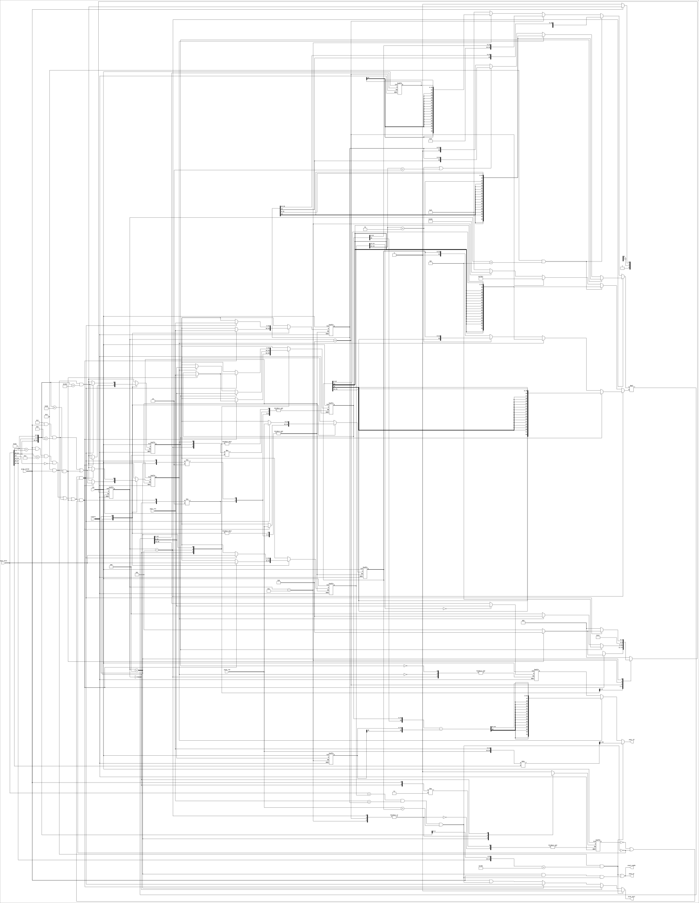
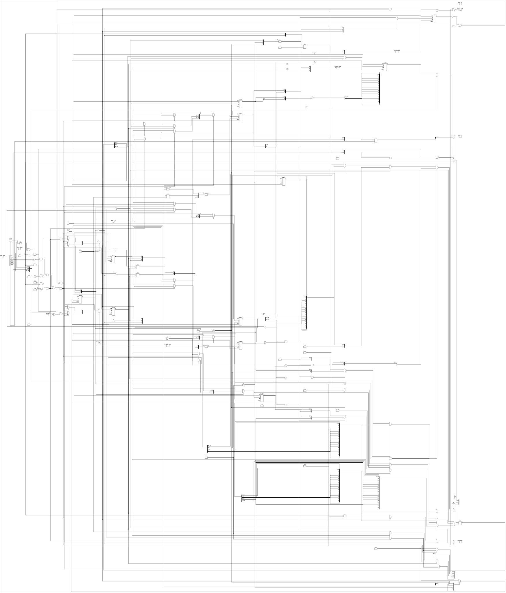
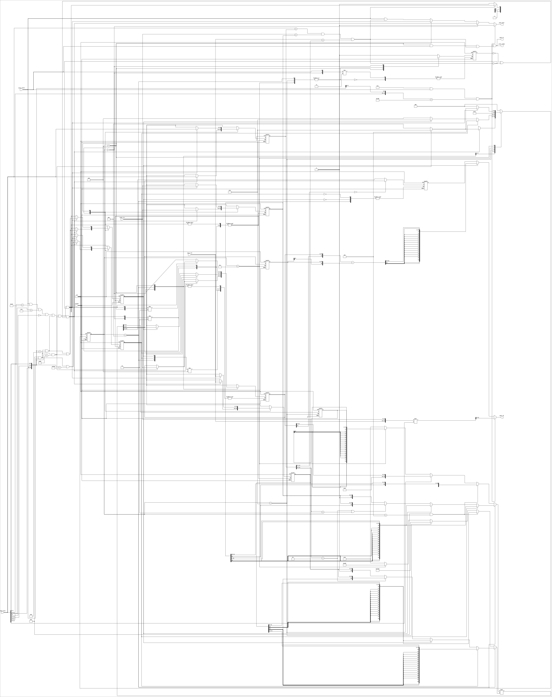
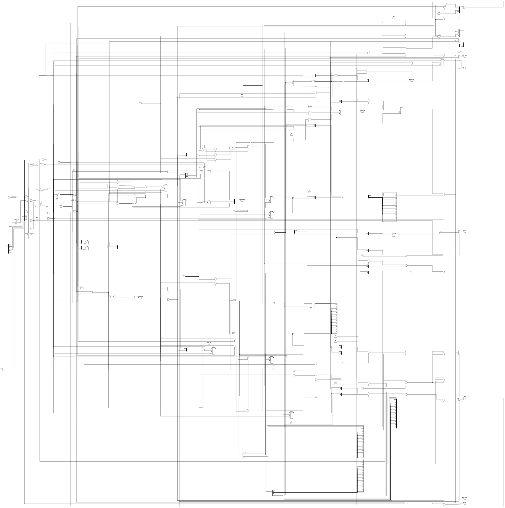
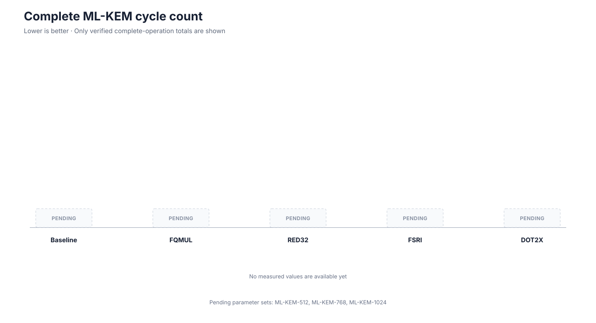
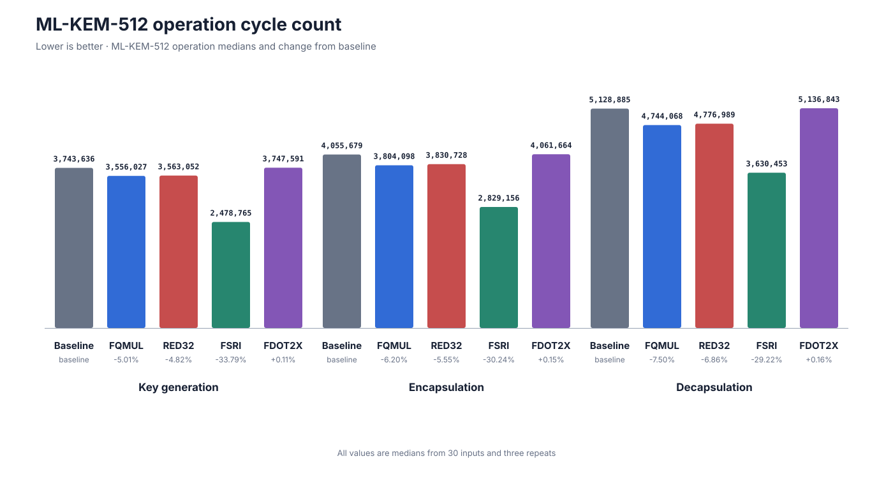
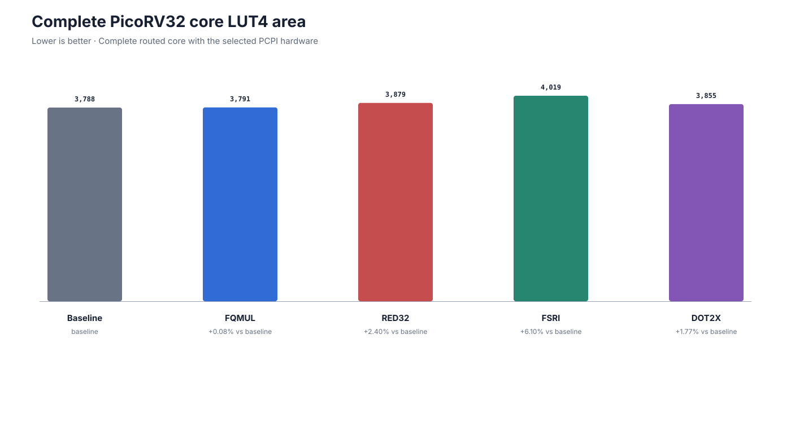

# Custom RISC-V Instructions for PQC Acceleration

## Overview

I added four custom RISC-V instructions to PicoRV32 to accelerate operations that ML-KEM performs repeatedly. Three target polynomial arithmetic around the NTT. The fourth targets the 64 bit rotations used by Keccak.

For a much more detailed explanation of the project, see my [full project write-up](https://ishankumthekar.com/projects/custom-risc-v-ml-kem-instructions).

The experiment uses a pinned version of [`mlkem-native`](https://github.com/pq-code-package/mlkem-native). It compares FQMUL, RED32, FSRI, and FDOT2X against the same baseline PicoRV32 configuration. Each custom build enables only the instruction being measured.

FSRI ended up being by far the most effective instruction. I originally expected the modular arithmetic instructions to matter more, but making Keccak's 64 bit rotations cheaper reduced complete ML-KEM cycle counts by roughly 31% to 33%.

## Instructions

### NTT Arithmetic

1. **FQMUL**

   Combines signed coefficient multiplication with Montgomery reduction.

   Example: `FQMUL(a, b) = MontgomeryReduce(a * b)`

2. **RED32**

   Leaves multiplication to the normal RISC-V `MUL` instruction and moves only Montgomery reduction into custom hardware.

   Example: `product = a * b`, followed by `RED32(product)`

3. **FDOT2X**

   Treats each source register as two packed signed 16 bit coefficients and accelerates the base multiplication path.

   Example: `FDOT2X(pack(a0, a1), pack(b0, b1)) = a0 * b1 + a1 * b0`

### Keccak

ML-KEM uses SHA-3 and SHAKE, which are built from Keccak. Keccak repeatedly rotates 64 bit values, but PicoRV32 has 32 bit registers. Those rotations normally expand into several instructions.

4. **FSRI**

   Joins two 32 bit registers and extracts a shifted 32 bit window. Two FSRI instructions implement one 64 bit rotation.

   Example: `FSRI(lo, hi, n) = low32(({hi, lo} >> n))`

### Synthesized Hardware

These schematics show the current parameterized PCPI block after Yosys lowered the RTL. Click an image to open the full SVG.

<p align="center">
  <a href="docs/schematics/fqmul-schematic.svg"></a>
  <a href="docs/schematics/red32-schematic.svg"></a><br>
  <sub>FQMUL and RED32</sub>
</p>

<p align="center">
  <a href="docs/schematics/fsri-schematic.svg"></a>
  <a href="docs/schematics/fdot2x-schematic.svg"></a><br>
  <sub>FSRI and FDOT2X</sub>
</p>

## Results

The figures below are generated from [`results/summary.json`](results/summary.json). The underlying machine readable measurements are in [`results/raw`](results/raw).

### Cycle Counts



FQMUL and RED32 reduce complete ML-KEM cycle counts by around 5%. FDOT2X does not improve the complete workload in this implementation. FSRI stands out with reductions of 30.86%, 31.74%, and 32.94% for ML-KEM-512, ML-KEM-768, and ML-KEM-1024.

This surprised me because I expected the modular arithmetic instructions to be more important.

### Cycles per ML-KEM Operation for ML-KEM-512



The same pattern appears across key generation, encapsulation, and decapsulation. FSRI produces the largest reduction in all three operations.

### Hardware Area



FQMUL adds almost no LUT4 area to the complete processor. RED32 and FDOT2X add modest area. FSRI has the largest increase at about 6.1%.

### Hardware Timing


Each bar is the median routed maximum frequency from five placement and routing seeds. The thin line beside each bar shows the range across those seeds. FQMUL and RED32 save cycles but lower routed frequency. FDOT2X has the largest timing penalty. FSRI does not show the same penalty.

FSRI's median is slightly above baseline, but that does not mean the instruction inherently raises the processor frequency. Placement and routing vary between builds and seeds.

### Result Interpretation

Once I combine the RTL cycle counts with each design's median routed frequency, FQMUL and RED32 are slightly slower than baseline. FDOT2X is about 18% slower. FSRI is the only instruction that clearly improves the complete tradeoff, with an estimated runtime reduction of about 33% to 35%. These are estimates from RTL cycles and routed frequency, not physical board timings.

The obvious place to optimize was ML-KEM's modular arithmetic. The best complete system result instead came from making Keccak's 64 bit rotations cheaper on a 32 bit processor.

## Reproducing the Results

The host tests require CMake 3.20 or newer, Python 3, and C and C++ compilers. The PicoRV32 flow uses RISC-V GNU toolchain release `2026.07.15` and OSS CAD Suite release `2026-07-29`. Put `verilator`, `riscv32-unknown-elf-gcc`, `riscv32-unknown-elf-objcopy`, and `riscv32-unknown-elf-objdump` on `PATH`. Formal and synthesis also require `sby`, `yosys`, `nextpnr-ecp5`, and `ecppack`.

Start from a fresh checkout of this branch:

```sh
git clone --branch simplify-baseline-vs-instructions https://github.com/ishanrk/embedded_mlkem_bench.git
cd embedded_mlkem_bench
```

Run the host tests:

```sh
cmake -S . -B build/release -DCMAKE_BUILD_TYPE=Release
cmake --build build/release --parallel 4
ctest --test-dir build/release --output-on-failure
```

Run each experiment stage independently:

```sh
python3 scripts/run_experiment.py --pcpi
python3 scripts/run_experiment.py --bench
python3 scripts/run_experiment.py --formal
python3 scripts/run_experiment.py --synthesis
python3 scripts/run_experiment.py --summary
```

The runner writes measurements under `build/picorv32/targets/picorv32/results`. Copy the completed benchmark and synthesis JSON files into the canonical directory, then regenerate the checked in summary and figures:

```sh
mkdir -p results/raw
cp build/picorv32/targets/picorv32/results/{baseline,fqmul,red32,fsri,dot2x}-{512,768,1024}.json results/raw/
cp build/picorv32/targets/picorv32/results/{baseline,fqmul,red32,fsri,dot2x}-synthesis.json results/raw/
python3 scripts/results.py --input results/raw --output results/summary.json
python3 scripts/readme_figures.py
```

## Formal Verification

[SymbiYosys checks](targets/picorv32/formal) compare the FQMUL, RED32, FSRI, and FDOT2X hardware against each instruction's intended operation. The saved completed runs for this branch record PASS for RED32 and FSRI. FQMUL and FDOT2X did not produce PASS before the local solver time limit, so those jobs remain pending rather than failed.

The properties verify the individual custom instruction RTL. They do not claim formal verification of all of PicoRV32 or complete ML-KEM.
