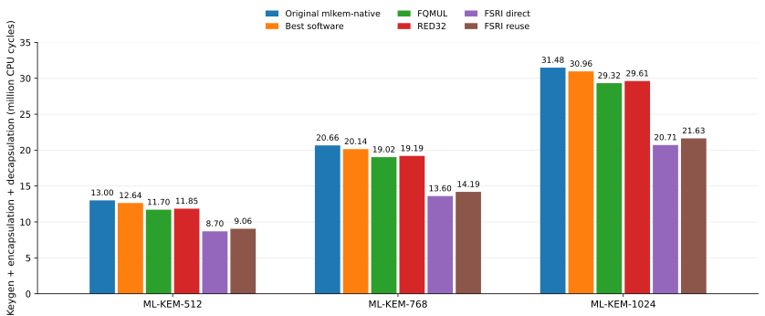
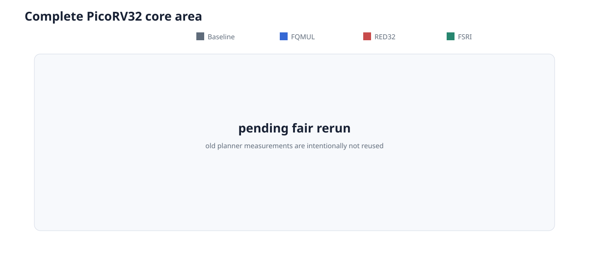
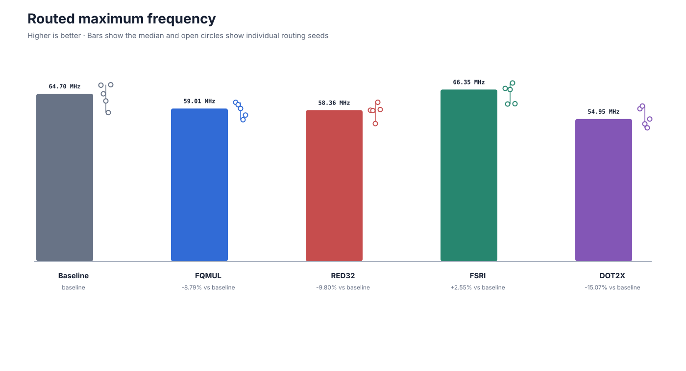

# pqc-poly-bench

End-to-end ML-KEM software/ISA co-design on RV32 PicoRV32.

The question is narrow: **can one custom instruction beat tuned software while staying inside a strict hardware budget?**

Budget: at most **+5% LUT4**, **+5% flip-flops**, **-2% median Fmax**, no extra DSP/BRAM, and all five ECP5 routing seeds must meet 50 MHz.

## Result

**No tested instruction meets the full budget.**

FSRI is the clear performance winner, exposing 64-bit Keccak rotations as the dominant acceleration opportunity on this RV32 core. The fast combinational implementation cuts end-to-end cycles by 31-33%, but costs too much area. A multiplier-reuse implementation keeps roughly 91% of that gain, but still misses area and loses too much timing margin. FQMUL and RED32 are much smaller performance wins and also miss the budget.

| design | geometric mean speedup vs tuned software | LUT4 change | FF change | median Fmax | 50 MHz seeds | budget |
|---|---:|---:|---:|---:|---:|:---:|
| FQMUL | 1.065x | +5.72% | +8.56% | 60.51 MHz | 5/5 | no |
| RED32 | 1.054x | +6.50% | +8.56% | 60.20 MHz | 5/5 | no |
| FSRI combinational | **1.476x** | +12.14% | 0.00% | 66.72 MHz | 5/5 | no |
| FSRI multiplier reuse | **1.415x** | +8.99% | +6.91% | 50.25 MHz | 3/5 | no |







### End-to-end cycle reduction vs tuned software

| design | ML-KEM-512 | ML-KEM-768 | ML-KEM-1024 |
|---|---:|---:|---:|
| FQMUL | 7.39% | 5.56% | 5.32% |
| RED32 | 6.25% | 4.75% | 4.36% |
| FSRI combinational | **31.15%** | **32.46%** | **33.11%** |
| FSRI multiplier reuse | **28.34%** | **29.56%** | **30.13%** |

The committed machine-readable numbers are in [`results/summary.json`](results/summary.json).

## Instructions

| instruction | operation | use |
|---|---|---|
| FQMUL | signed 16x16 multiply + ML-KEM Montgomery reduction | polynomial arithmetic |
| RED32 | ML-KEM Montgomery reduction of a signed 32-bit product | polynomial arithmetic |
| FSRI | `low32({rs2, rs1} >> shamt)` | two instructions implement one 64-bit Keccak rotate |

FQMUL and RED32 use the RISC-V `custom-0` opcode space. FSRI is a project-local encoding of the earlier RISC-V Bitmanip funnel-shift idea; it is not claimed as a new instruction concept.

The current RTL contains the multiplier-reuse FSRI. The combinational FSRI numbers were measured at commit `1b1d01aaaffe48a0bfff3cdc096cca526f8a40ca`.

## Important files

- [`targets/picorv32/rtl/pqc_pcpi_mlkem.sv`](targets/picorv32/rtl/pqc_pcpi_mlkem.sv) — custom instruction datapath and PCPI state machine
- [`targets/picorv32/rtl/pqc_picorv32_core_top.sv`](targets/picorv32/rtl/pqc_picorv32_core_top.sv) — PicoRV32 integration
- [`targets/picorv32/mlkem/`](targets/picorv32/mlkem/) — C models and inline instruction wrappers
- [`targets/picorv32/firmware/mlkem_bench.c`](targets/picorv32/firmware/mlkem_bench.c) — end-to-end ML-KEM benchmark
- [`targets/picorv32/formal/fsri.sby`](targets/picorv32/formal/fsri.sby) — targeted FSRI PCPI/RVFI bounded checks
- [`results/summary.json`](results/summary.json) — final comparison

Everything else is build, code-generation, test, or measurement support.

## Method

`mlkem-native` is pinned and compiled as bare-metal RV32IMC firmware. The software baseline is the best of 24 legal arithmetic schedules per ML-KEM parameter set. Each custom instruction is evaluated on the same PicoRV32 configuration with Verilator cycle counts and five-seed ECP5 synthesis/place-and-route.

Pinned sources:

- PicoRV32 `a473fc8fca393771d83b0ffcf0b14db3393339d8`
- mlkem-native `69d24e37b8a04c6050ec55bc84a4228d7051bb4b`
- RISC-V GNU toolchain `2026.07.15`
- OSS CAD Suite `2026-07-29`

This is an RTL/FPGA study. It does not claim physical-board timing or side-channel resistance.

## Build

Host tests:

```bash
cmake --preset release
cmake --build --preset release --parallel
ctest --preset release
```

Target experiment:

```bash
cmake -S . -B build/picorv32 -G Ninja \
  -DCMAKE_BUILD_TYPE=Release \
  -DPQC_POLY_LTO=OFF \
  -DPQC_POLY_PICORV32_MLKEM=ON \
  -DPQC_POLY_PICORV32_SYNTHESIS=ON

cmake --build build/picorv32 --parallel 8 \
  --target pqc-picorv32-mlkem pqc-picorv32-fqmul pqc-picorv32-red32 pqc-picorv32-fsri
```

Synthesis targets are `pqc-picorv32-fqmul-synthesis`, `pqc-picorv32-red32-synthesis`, and `pqc-picorv32-fsri-synthesis`. The multiplier-reuse FSRI synthesis target is expected to return nonzero because two of five seeds miss 50 MHz; its JSON is still written.

Targeted FSRI formal:

```bash
targets/picorv32/formal/fsri.sh build/picorv32
```

## References

- NIST, [FIPS 203: ML-KEM](https://doi.org/10.6028/NIST.FIPS.203)
- [`mlkem-native`](https://github.com/pq-code-package/mlkem-native)
- Alkim et al., [ISA Extensions for Finite Field Arithmetic: Accelerating Kyber and NewHope on RISC-V](https://doi.org/10.13154/TCHES.V2020.I3.219-242)
- RISC-V Bitmanip v0.93 funnel-shift specification: [`bext.tex`](https://github.com/riscv/riscv-bitmanip/blob/v0.93/texsrc/bext.tex)
