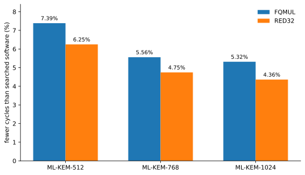

# ML-KEM software and custom RISC-V instructions on PicoRV32

This repository measures ML-KEM software schedules and two small custom RISC-V instructions on PicoRV32. The ML-KEM implementation comes from a pinned `mlkem-native` revision. Each candidate is compiled as bare-metal RV32IMC code and run on PicoRV32 RTL with Verilator. The same RTL is synthesized for an ECP5 FPGA.

The goal is to measure a concrete tradeoff: how many ML-KEM cycles can a small arithmetic instruction save, and what does that instruction cost in FPGA area and timing?

## Results

The software search tests 24 schedules for each ML-KEM parameter set. The same schedule choices are tested again with FQMUL and RED32.

Complete cycles below are the sum of the median key-generation, encapsulation, and decapsulation cycle counts for the best schedule in each group.

| parameter set | searched software | FQMUL | RED32 | FQMUL change | RED32 change |
|---|---:|---:|---:|---:|---:|
| ML-KEM-512 | 12,636,735 | **11,703,506** | 11,847,177 | **-7.39%** | -6.25% |
| ML-KEM-768 | 20,143,356 | **19,023,552** | 19,187,466 | **-5.56%** | -4.75% |
| ML-KEM-1024 | 30,964,081 | **29,318,051** | 29,614,042 | **-5.32%** | -4.36% |



At the fixed 50 MHz test clock, both instructions reduce end-to-end ML-KEM cycles. FQMUL is faster in all three parameter sets.

The FPGA results show the cost of those cycle reductions.

| design | LUT4 | flip-flops | DSP | BRAM | median routed Fmax |
|---|---:|---:|---:|---:|---:|
| baseline | 3,583 | 970 | 4 | 0 | 68.70 MHz |
| FQMUL | 3,788 (+5.72%) | 1,053 (+8.56%) | 4 | 0 | 60.51 MHz (-11.92%) |
| RED32 | 3,816 (+6.50%) | 1,053 (+8.56%) | 4 | 0 | 60.20 MHz (-12.37%) |

All five routed seeds for FQMUL and RED32 meet the 50 MHz target. The lower Fmax still matters. These results show fewer cycles at a fixed clock. They do not show that either design would beat the baseline if every design were clocked at its own maximum routed frequency.

The current custom-instruction RTL is the first implementation. It shares one generic 33-bit signed multiplier across ordinary RISC-V multiply, FQMUL, and RED32. The results above should be read as a measured starting point for a later microarchitecture pass.

The numbers used in this section are stored in [`results/current-comparison.json`](results/current-comparison.json). The figure is generated directly from that file by [`scripts/plot_results.py`](scripts/plot_results.py).

## What is being searched

ML-KEM uses NTTs and base multiplication for polynomial arithmetic. Equivalent implementations can schedule those operations in different ways. This repository searches four choices:

| part | choices |
|---|---|
| forward NTT | one layer at a time, fuse two layers |
| inverse NTT | one layer at a time, fuse two layers |
| inverse reduction | after every layer, after each layer pair |
| base multiplication | cached late reduction, cached eager reduction, direct eager reduction |

That gives 24 schedules per parameter set and 72 schedules over ML-KEM-512, ML-KEM-768, and ML-KEM-1024. The best software-only schedule is `ffuse2_ifuse2_rpair_bcachelate` for all three parameter sets.

Schedule generation and checking live in [`src/`](src/). Generated code is compiled with `-O3` for RV32IMC and linked into the bare-metal benchmark firmware in [`targets/picorv32/firmware/`](targets/picorv32/firmware/).

## Custom instructions

Both instructions use the RISC-V `custom-0` major opcode. The RISC-V opcode map recommends `custom-0` through `custom-3` for custom extensions. PicoRV32 exposes unsupported non-branching instructions through its Pico Co-Processor Interface, or PCPI. The custom arithmetic unit in this repository connects through that interface.

ML-KEM uses `q = 3329` and a Montgomery radix of `2^16`. Both instructions use the same Montgomery reduction step.

### FQMUL

FQMUL takes the signed low 16 bits of `rs1` and `rs2`. It multiplies them and reduces the product modulo `q` in one PCPI request.

```text
a = sign16(rs1)
b = sign16(rs2)
t = a * b
u = sign16((low16(t) * 62209) mod 2^16)
rd = (t - u * 3329) / 2^16
```

Encoding: `custom-0`, `funct3 = 0`, `funct7 = 0`. The current RTL responds after four arithmetic cycles.

Source: [`targets/picorv32/mlkem/fqmul.h`](targets/picorv32/mlkem/fqmul.h) contains the C model and inline instruction. [`targets/picorv32/rtl/pqc_pcpi_mlkem.sv`](targets/picorv32/rtl/pqc_pcpi_mlkem.sv) contains the hardware implementation. The completed formal and CBMC record is [`fqmul-formal.json`](results/raw/picorv32-step3-fd803594-69d24e37/fqmul-formal.json).

The reduction follows the same Montgomery form used by the Kyber reference implementation. Alkim et al. studied closely related finite-field RISC-V instructions for Kyber and NewHope in [ISA Extensions for Finite Field Arithmetic](https://doi.org/10.13154/TCHES.V2020.I3.219-242).

### RED32

RED32 accepts an already-computed signed 32-bit product in `rs1` and performs only the Montgomery reduction.

```text
t = sign32(rs1)
u = sign16((low16(t) * 62209) mod 2^16)
rd = (t - u * 3329) / 2^16
```

Encoding: `custom-0`, `funct3 = 1`, `funct7 = 0`. `rs2` is encoded as `x0`. The current RTL responds after three arithmetic cycles.

An ML-KEM multiplication using RED32 therefore executes a standard RISC-V `MUL` first and RED32 second. This tests whether keeping multiplication outside the custom operation gives a better hardware tradeoff than FQMUL.

Source: [`targets/picorv32/mlkem/red32.h`](targets/picorv32/mlkem/red32.h) contains the C model and inline instruction. The hardware shares [`pqc_pcpi_mlkem.sv`](targets/picorv32/rtl/pqc_pcpi_mlkem.sv) with FQMUL. [`red32_pcpi.cpp`](targets/picorv32/sim/red32_pcpi.cpp) is the direct Verilator test for the instruction.

## Testing

The project tests the generated software and the custom hardware at several levels.

| test | what is checked | current result |
|---|---|---|
| host unit tests | plan enumeration, legality checks, code generation, result parsing | pass |
| ASan and UBSan build | generated host code and test suite under sanitizers | pass |
| FQMUL formal and CBMC | PCPI arithmetic, handshake, standard multiply behavior, bounded RVFI retirement, C models | pass |
| RED32 direct RTL test | arithmetic result, 3-cycle latency, reset, back-to-back requests, decode isolation | pass |
| full RED32 ML-KEM sweep | 72 generated schedules running on PicoRV32 RTL | pass |
| ECP5 synthesis | LUT4, flip-flops, DSP, BRAM, routed Fmax over five seeds | complete |
| RED32 formal | PCPI proof, bounded RVFI proof, RVFI cover | pass |
| RED32 noninterference PDR | unbounded comparison with RED32 disabled | not completed |

The direct RED32 RTL test covers 13 boundary inputs, all 65,536 possible low 16-bit values, and 100,000 deterministic random 32-bit inputs. It also checks that ordinary `MUL` still behaves correctly and that FQMUL is not decoded as RED32.

The full RED32 sweep runs 24 schedules for each parameter set. Every schedule records 510 measurements: five kernels over 16 inputs with three repeats, then key generation, encapsulation, and decapsulation over 30 inputs with three repeats. This gives 12,240 measurement records per parameter set. Repeated runs must agree. Decapsulation also checks that the two shared secrets match.

The RED32 PCPI proof passed. The 24-cycle RVFI bounded check and RVFI cover passed. The separate unbounded noninterference proof did not converge in practical time and was stopped. It did not produce a PASS or FAIL result. The status is saved in [`results/red32-verification.json`](results/red32-verification.json).

The test suite does not prove physical side-channel resistance. The cycle results come from RTL simulation. FPGA frequency and area come from synthesis and routing rather than a physical board run.

## Reproduce the results

A normal host build needs CMake and a C++20 compiler.

```bash
cmake --preset release
cmake --build --preset release --parallel
ctest --preset release
```

Run the sanitizer build separately:

```bash
cmake --preset sanitize
cmake --build --preset sanitize --parallel
ASAN_OPTIONS=detect_leaks=0 ctest --preset sanitize
```

The completed target experiments used these tool releases:

| tool | release |
|---|---|
| RISC-V GNU toolchain | 2026.07.15 |
| OSS CAD Suite | 2026-07-29 |
| CBMC | 6.10.0, verification only |

Put the RISC-V toolchain and OSS CAD Suite executables on `PATH`. The target build fetches the pinned PicoRV32 and `mlkem-native` sources itself.

Configure one build directory for simulation and synthesis:

```bash
cmake -S . -B build/picorv32-study -G Ninja \
  -DCMAKE_BUILD_TYPE=Release \
  -DPQC_POLY_LTO=OFF \
  -DPQC_POLY_PICORV32_MLKEM=ON \
  -DPQC_POLY_PICORV32_SYNTHESIS=ON
```

Run the searched software baseline:

```bash
cmake --build build/picorv32-study \
  --target pqc-picorv32-mlkem \
  --parallel 8
```

Run FQMUL and RED32:

```bash
cmake --build build/picorv32-study \
  --target pqc-picorv32-fqmul \
  --parallel 8

cmake --build build/picorv32-study \
  --target pqc-picorv32-red32-pcpi \
  --parallel 8

cmake --build build/picorv32-study \
  --target pqc-picorv32-red32 \
  --parallel 8
```

Run the hardware comparison:

```bash
cmake --build build/picorv32-study \
  --target pqc-picorv32-fqmul-synthesis \
  --parallel 8

cmake --build build/picorv32-study \
  --target pqc-picorv32-red32-synthesis \
  --parallel 8
```

Create the same comparison JSON from the generated measurements:

```bash
python3 scripts/report_results.py build/picorv32-study \
  --output results/current-comparison.json
```

Regenerate the README graph with Matplotlib:

```bash
python3 scripts/plot_results.py
```

Formal verification is separate from the performance and synthesis runs. Enable it with `-DPQC_POLY_PICORV32_FQMUL_VERIFY=ON`. The aggregate RED32 verification target includes the noninterference PDR task described above, so it may run for a long time.

### Output locations

| output | path |
|---|---|
| searched software and FQMUL measurements | `build/picorv32-study/targets/picorv32/mlkem-results/` |
| RED32 measurements | `build/picorv32-study/targets/picorv32/red32-results/` |
| synthesis JSON | `build/picorv32-study/targets/picorv32/results/` |
| committed Step 3 records | `results/raw/picorv32-step3-fd803594-69d24e37/` |
| compact current comparison | `results/current-comparison.json` |

The full sweeps produce large JSONL files. They are generated from the pinned code and toolchain rather than duplicated in the README.

## Source map

| path | purpose |
|---|---|
| [`src/`](src/) | schedule generation, checking, and report logic |
| [`targets/picorv32/mlkem/`](targets/picorv32/mlkem/) | ML-KEM arithmetic wrappers for the custom instructions |
| [`targets/picorv32/rtl/`](targets/picorv32/rtl/) | PicoRV32 PCPI integration and custom arithmetic RTL |
| [`targets/picorv32/sim/`](targets/picorv32/sim/) | Verilator harness and direct instruction tests |
| [`targets/picorv32/synth/`](targets/picorv32/synth/) | ECP5 synthesis and place-and-route flow |
| [`targets/picorv32/formal/`](targets/picorv32/formal/) | SymbiYosys and RVFI properties |
| [`results/`](results/) | committed experiment summaries and earlier raw records |

## References

ML-KEM is specified in [NIST FIPS 203](https://doi.org/10.6028/NIST.FIPS.203). The implementation under test is the pinned [`mlkem-native`](https://github.com/pq-code-package/mlkem-native) codebase.

PicoRV32 and its PCPI interface are documented in the [PicoRV32 repository](https://github.com/YosysHQ/picorv32). The RISC-V opcode map documents the [`custom-0` through `custom-3` opcode spaces](https://docs.riscv.org/reference/isa/v20260120/unpriv/rv-32-64g.html).

The Montgomery-reduction structure can also be seen in the [Kyber reference `reduce.c`](https://github.com/pq-crystals/kyber/blob/main/ref/reduce.c). For prior work on small RISC-V finite-field instructions for Kyber and NewHope, see E. Alkim, H. Evkan, N. Lahr, R. Niederhagen, and R. Petri, [ISA Extensions for Finite Field Arithmetic: Accelerating Kyber and NewHope on RISC-V](https://doi.org/10.13154/TCHES.V2020.I3.219-242), TCHES 2020(3).
