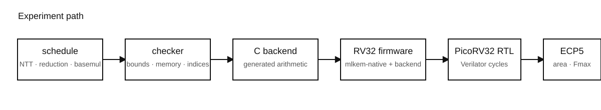
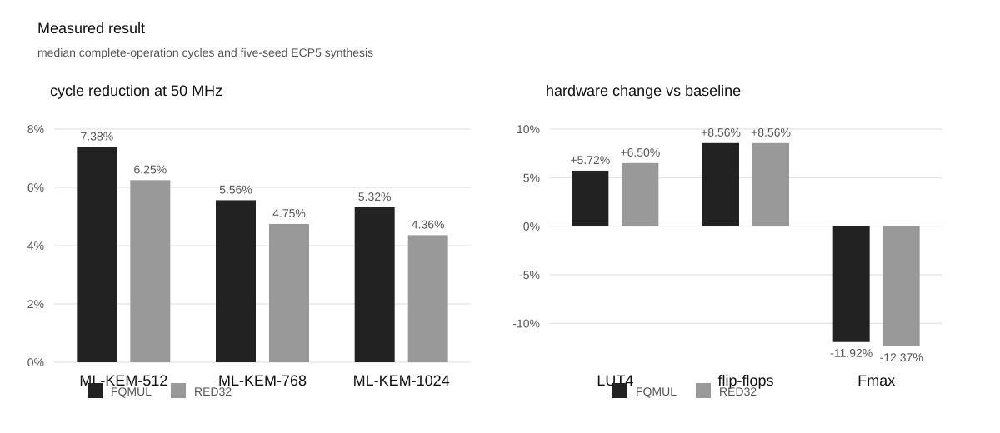

# ML-KEM software and RISC-V co-design on PicoRV32

This repository measures how much ML-KEM benefits from software schedule changes and small custom RISC-V arithmetic instructions on a resource-constrained RV32 core.

The target is [PicoRV32](https://github.com/YosysHQ/picorv32). ML-KEM comes from a pinned [mlkem-native](https://github.com/pq-code-package/mlkem-native) revision and follows [FIPS 203](https://csrc.nist.gov/pubs/fips/203/final). The experiment generates several equivalent arithmetic schedules, checks them, compiles them to bare-metal RV32IMC firmware, runs the firmware on PicoRV32 RTL with Verilator, then synthesizes the same core for an ECP5 FPGA.

The question is simple: if one small instruction saves ML-KEM cycles, how much area and timing does that instruction cost?



## Current result

The software search found the same best no-extension schedule for ML-KEM-512, ML-KEM-768, and ML-KEM-1024. Two custom instructions were then tested against that software baseline.

`FQMUL` fuses a signed 16-bit multiply with ML-KEM Montgomery reduction. `RED32` performs the 32-bit reduction only, so generated code uses a normal `MUL` before `RED32`.

| parameter set | searched software | FQMUL | RED32 |
|---|---:|---:|---:|
| ML-KEM-512 | 12,636,735 cycles | **11,703,506** | 11,847,177 |
| ML-KEM-768 | 20,143,356 cycles | **19,023,552** | 19,187,466 |
| ML-KEM-1024 | 30,964,081 cycles | **29,318,051** | 29,614,042 |

At the fixed 50 MHz experiment clock, FQMUL saves 7.39%, 5.56%, and 5.32% across the three parameter sets. RED32 saves 6.25%, 4.75%, and 4.36%.

The hardware cost is large enough to matter.

| design | LUT4 | flip-flops | DSP | median routed Fmax |
|---|---:|---:|---:|---:|
| baseline | 3,583 | 970 | 4 | 68.70 MHz |
| FQMUL | 3,788 (+5.72%) | 1,053 (+8.56%) | 4 | 60.51 MHz (-11.92%) |
| RED32 | 3,816 (+6.50%) | 1,053 (+8.56%) | 4 | 60.20 MHz (-12.37%) |

All five synthesis seeds for both custom instructions still meet 50 MHz. FQMUL is the better of the two current implementations: it uses fewer LUTs, reaches a slightly higher Fmax, and produces fewer ML-KEM cycles.

The present RTL is a first hardware implementation rather than a completed microarchitecture search. FQMUL and RED32 share a generic 33 by 33 signed multiplier with state-dependent muxing. The next useful experiment is to optimize that datapath and measure the new Pareto points before drawing a final conclusion about the instruction idea.



## The experiment

ML-KEM spends much of its arithmetic time in NTTs and base multiplication. There are several legal ways to order those operations and to decide when values are reduced. The generated schedules all implement the same ML-KEM arithmetic. They differ in execution order, temporary storage, and where modular reduction occurs.

The schedule space uses these choices:

| field | values |
|---|---|
| parameter set | 512, 768, 1024 |
| forward NTT | one layer at a time, or fuse two layers |
| inverse NTT | one layer at a time, or fuse two layers |
| inverse reduction | reduce every layer, or after each layer pair |
| base multiplication | cached late, cached eager, direct eager |
| arithmetic instruction | standard multiply, FQMUL, or RED32 |

For example,

```text
mlk768_ffuse2_ifuse2_rpair_bdirecteager_xfqmul
```

means ML-KEM-768, two-layer forward NTT fusion, two-layer inverse NTT fusion, pairwise inverse reduction, direct eager base multiplication, and the FQMUL instruction.

The original software/FQMUL search contains 144 plans: 72 software plans and 72 FQMUL plans. RED32 adds another 72-plan comparison over the same software dimensions.

## The two custom instructions

Both instructions use the RISC-V `custom-0` opcode space. The RISC-V opcode map reserves `custom-0` through `custom-3` for custom extensions. These encodings are local to this experiment.

ML-KEM uses modulus `q = 3329` and Montgomery radix `R = 2^16`. The reduction implemented here is equivalent to:

```text
u = ((t & 0xffff) * 62209) & 0xffff
u = sign_extend_16(u)
r = (sign_extend_32(t) - u * 3329) / 65536
```

The numerator is exactly divisible by 65536 for the inputs used by the operation.

### FQMUL

FQMUL takes the signed low 16 bits of two registers. It multiplies them and performs the reduction in one PCPI request.

```text
t = sign16(rs1) * sign16(rs2)
rd = montgomery_reduce(t)
```

The current implementation returns after four arithmetic cycles. Its instruction match is `0x0000000b` under mask `0xfe00707f`.

### RED32

RED32 takes one signed 32-bit value and reduces it. `rs2` is fixed to `x0`.

```text
t = rs1
rd = montgomery_reduce(t)
```

Generated ML-KEM code therefore computes a standard `MUL` first and then issues RED32. Its instruction match is `0x0000100b` under the same mask.

## Baselines

Three baselines appear in the result files and they serve different purposes.

| name | meaning |
|---|---|
| portable | the pinned mlkem-native portable arithmetic path |
| searched software | the fastest generated `xnone` schedule using standard RISC-V multiply |
| stock multiplier | PicoRV32's own fast multiplier, used as a substrate cross-check |

The searched software schedule wins over the portable arithmetic path by 2.83% on ML-KEM-512, 2.49% on ML-KEM-768, and 1.64% on ML-KEM-1024.

The project PCPI implementation of the standard multiply instructions was also checked against PicoRV32's stock multiplier before the ML-KEM experiments. This keeps the custom-instruction comparison tied to a known CPU substrate.

## Measurement protocol

Every candidate is compiled into bare-metal RV32IMC firmware and executed on Verilated PicoRV32 RTL. Host timing is never used as the ML-KEM performance number.

Each plan runs 16 deterministic inputs for each arithmetic kernel and 30 deterministic inputs for key generation, encapsulation, and decapsulation. Every input is repeated three times. A repeated measurement must produce identical cycle and retired-instruction counts.

The firmware measures five kernels:

```text
forward NTT
inverse NTT
mulcache
base multiplication
tomont
```

It also measures complete ML-KEM key generation, encapsulation, and decapsulation. Decapsulation checks that both shared secrets match.

The simulator records calibrated cycles, retired instructions, runtime stack high water, explicit scratch space, caller working storage, and allocated flash. It also reads the disassembly and checks that custom opcodes occur only in the approved arithmetic functions.

FPGA measurements use the LFE5U-45F-6BG381C ECP5 target. Yosys performs synthesis and nextpnr-ecp5 runs five placement seeds at a 50 MHz target. The result records LUT4 count, flip-flops, DSP blocks, BRAM use, and routed maximum frequency.

## Verification

The generated schedules are checked independently before code generation. The checker reconstructs butterfly coverage, twiddle order, fusion groups, coefficient bounds, accumulator bounds, scratch use, caller workspace, and the declared legal or rejected state.

Host tests cover schedule generation, generated C, result parsing, and target metadata. AddressSanitizer and UndefinedBehaviorSanitizer builds are available.

FQMUL has a CBMC model check, SymbiYosys PCPI arithmetic and handshake checks, and a bounded RVFI retirement check.

RED32 has a direct Verilator PCPI test over boundary values, every low 16-bit value, and 100,000 deterministic random 32-bit inputs. The same test checks three-cycle latency, reset cancellation, back-to-back requests, and ordinary multiply behavior. Its PCPI proof passed. A 24-cycle RVFI BMC passed and the RVFI cover task passed. The separate unbounded noninterference PDR task has not completed in practical time, so this repository does not claim that proof.

These checks do not establish physical side-channel resistance, complete ML-KEM functional correctness at the RTL level, or production suitability. The current experiments also do not include execution on a physical FPGA board.

## Build

A normal host build needs CMake and a C++20 compiler.

```bash
cmake --preset release
cmake --build --preset release --parallel
ctest --preset release
```

The sanitizer build is separate:

```bash
cmake --preset sanitize
cmake --build --preset sanitize --parallel
ASAN_OPTIONS=detect_leaks=0 ctest --preset sanitize
```

The target flows use pinned RISC-V and OSS CAD Suite releases. The CMake configuration checks the required tools before running.

A full RED32 measurement and synthesis build can be configured with:

```bash
cmake -S . -B build/picorv32-red32 -G Ninja \
  -DCMAKE_BUILD_TYPE=Release \
  -DPQC_POLY_LTO=OFF \
  -DPQC_POLY_PICORV32_MLKEM=ON \
  -DPQC_POLY_PICORV32_SYNTHESIS=ON
```

Run the instruction-level RTL test first:

```bash
cmake --build build/picorv32-red32 \
  --target pqc-picorv32-red32-pcpi \
  --parallel 8
```

Build the generated RV32 firmware:

```bash
cmake --build build/picorv32-red32 \
  --target pqc-picorv32-red32-build \
  --parallel 8
```

Run all 72 RED32 schedules on the PicoRV32 RTL model:

```bash
cmake --build build/picorv32-red32 \
  --target pqc-picorv32-red32 \
  --parallel 8
```

Run the five-seed baseline and RED32 ECP5 synthesis:

```bash
cmake --build build/picorv32-red32 \
  --target pqc-picorv32-red32-synthesis \
  --parallel 8
```

Formal verification is a separate target and is not required by the commands above.

## Result provenance

Completed Step 1 through Step 3 records are committed under `results/raw/`. The directory names include the relevant repository and dependency revisions.

The main pinned revisions used by the completed comparison are:

| component | revision |
|---|---|
| PicoRV32 | `a473fc8fca393771d83b0ffcf0b14db3393339d8` |
| mlkem-native | `69d24e37b8a04c6050ec55bc84a4228d7051bb4b` |
| Step 3 repository base | `fd8035940c25912bccb9c6d7c73611a5290fcee4` |
| current RED32 branch result | `25dff836be6cee7b68b0f951de325ef6970a2d5e` |

The canonical Step 3 summary is `results/raw/picorv32-step3-fd803594-69d24e37/fqmul-final-comparison.json`.

The RED32 cycle and synthesis numbers in this README were produced from the current `step4-red32-local` branch at `25dff83`. The build products are generated locally rather than committed as a second large raw-result snapshot.

## Repository map

| path | purpose |
|---|---|
| `src/mlkem_plan.cpp` | schedule enumeration, bounds, and winner selection |
| `src/mlkem_check.cpp` | independent schedule checker |
| `src/mlkem_codegen.cpp` | C generation for software and FQMUL schedules |
| `src/mlkem_red32*.cpp` | current RED32 experiment path |
| `targets/picorv32/firmware/` | bare-metal benchmark firmware |
| `targets/picorv32/rtl/` | PCPI arithmetic and PicoRV32 wrappers |
| `targets/picorv32/sim/` | Verilator harness and measurement writer |
| `targets/picorv32/formal/` | SymbiYosys and RVFI properties |
| `targets/picorv32/synth/` | ECP5 synthesis and place-and-route flow |
| `results/raw/` | committed experiment records |
| `tests/` | host correctness and regression tests |

The RED32 path currently duplicates parts of the plan and checker code. That is implementation debt rather than a research requirement. A cleanup should fold RED32 into the existing plan machinery before more instruction variants are added.

## References

The cryptographic algorithm is defined by [NIST FIPS 203](https://csrc.nist.gov/pubs/fips/203/final). The implementation base is [pq-code-package/mlkem-native](https://github.com/pq-code-package/mlkem-native). The CPU target is [YosysHQ/PicoRV32](https://github.com/YosysHQ/picorv32). The experimental instruction encodings use the custom opcode space shown in the [RISC-V unprivileged opcode map](https://docs.riscv.org/reference/isa/v20260120/unpriv/rv-32-64g.html).
