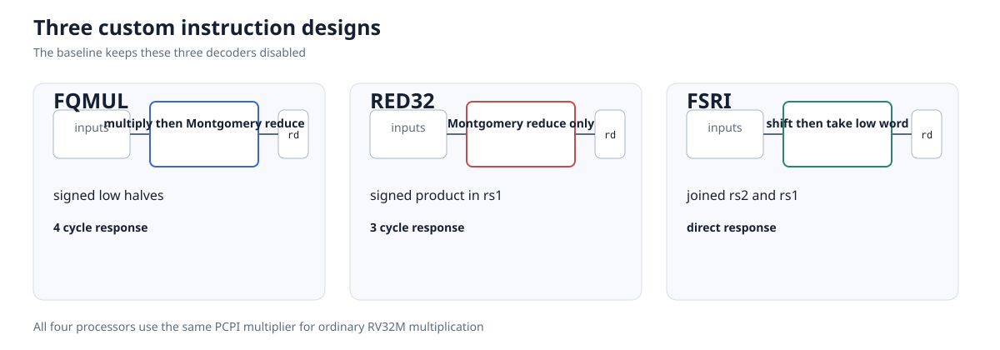

# pqc-poly-bench

# Project Idea

ML-KEM is a post-quantum key encapsulation mechanism used to establish a shared secret between two parties, which can then be used to set up an encrypted communication channel. It has three parameter sets, ML-KEM-512, ML-KEM-768, and ML-KEM-1024. A large part of its runtime on a small processor comes from two kinds of operations [1].

1. The first is polynomial arithmetic such as the number theoretic transform (NTT), inverse NTT, field multiplication, and Montgomery reduction. The NTT is a transform that makes polynomial multiplication cheaper. Montgomery reduction is a way of avoiding expensive division when repeatedly reducing values modulo the ML-KEM field order $q=3329$.

2. The second is SHA-3/SHAKE [2]. These hash and extendable-output functions are used throughout ML-KEM. In the pinned source, SHAKE128 generates the public matrix, SHAKE256 samples secret and error polynomials, SHA3-256 hashes the public key, SHA3-512 derives seeds and encapsulation key material, and SHAKE256 derives the rejection secret during failed decapsulation. They all use Keccak-f[1600], a 24-round permutation whose state contains 25 lanes of 64 bits. Its round function performs many rotations on those lanes [3].

The goal of this project was to see whether small RISC-V hardware extensions [4], which can be thought of as specialized instructions that the processor is allowed to execute, could make complete ML-KEM faster on an embedded processor without adding too much hardware area or making the processor's critical path significantly slower.

I used PicoRV32 as the reference processor and `mlkem-native` as the ML-KEM implementation. Both are pinned to exact commits [5, 7]. The processor configuration is RV32IMC with a dual-port register file, compressed instructions, a barrel shifter, division, and normal hardware multiplication. Including ordinary `MUL` matters. Otherwise a multiply/reduce instruction would be compared with a processor that has no hardware multiplier and would receive an unfair advantage.

Before adding custom hardware, I generated and tested different ways of implementing the main ML-KEM polynomial operations in software. A software implementation here means ordinary C and RV32IMC instructions that compute the same required result. The basic idea is that mathematically equivalent operations can be reordered or combined to execute fewer instructions.

For example, suppose several arithmetic operations eventually need reduction modulo $q$. Reducing after every operation keeps intermediate values small, but performs more reductions. Another option is to keep an intermediate value in a 32-bit register, perform several operations, and reduce once at the end. This saves instructions, but a value can overflow if reduction is delayed for too long. The generator checks bounds before accepting a choice.

The project tries 24 legal arithmetic arrangements per parameter set:

* two forward NTT traversals, either stage by stage or with two layers fused;
* two inverse NTT traversals with the same choice;
* reduction of inverse-NTT sums after every layer or after a safe pair of layers;
* three base-multiplication strategies: cache a multiplied coefficient and reduce late, cache it and reduce products eagerly, or recompute it and reduce eagerly.

An arithmetic schedule does not mean that two versions run at the same time. Each schedule is a separate generated C implementation, built and measured by itself. PicoRV32 is not a dual-issue processor. The schedule changes the order and grouping of work, which changes the number of reductions, loads, stores, branches, and loop operations. Fusing two NTT layers, for example, can keep more intermediate values in registers. Delaying the final base-multiplication reduction can replace several reductions with one safe 32-bit accumulation.

All 24 choices pass the static legality checks and host reference tests for all three parameter sets. I select the one with the smallest sum of measured key-generation, encapsulation, and decapsulation medians. The best no-extension implementation uses fused forward and inverse traversals, paired inverse reduction, and cached late base multiplication. The `mlk.fqmul` search is rerun with the instruction enabled, so its best base-multiplication choice is allowed to differ. This gives me a tuned software implementation to compare the custom instructions against instead of an unnecessarily slow baseline.

I then implemented three custom RISC-V instructions that target different expensive parts of ML-KEM:

1. `mlk.fqmul` combines coefficient multiplication and Montgomery reduction. It targets polynomial arithmetic used in the NTT, inverse NTT, base multiplication, multiplication caches, and Montgomery-domain conversion.

2. `mlk.red32` performs Montgomery reduction on an already computed 32-bit product. Multiplication is still an ordinary RISC-V `MUL`; only reduction moves into the custom operation. This is an independently implemented comparison to the standalone reduction approach studied by Bevin, Khalid, Imran, and O'Neill [6].

3. `fsri` is a funnel-shift-right instruction based on an earlier RISC-V Bitmanip design [12]. Keccak uses 64-bit lanes, but PicoRV32 has 32-bit integer registers, so each lane is held in two pieces. A 64-bit rotation otherwise requires several 32-bit shifts and logical operations. FSRI combines the relevant pieces and therefore targets SHA-3/SHAKE rather than polynomial arithmetic.

The experiment runs complete ML-KEM key generation, encapsulation, and decapsulation with tuned software and with each extension. It compares both processor cycles saved and the additional hardware area and timing cost. The acceptance budget is strict: at most 5% more LUT4s, 5% more flip-flops, 2% lower median maximum frequency, no extra DSP or BRAM, and all five routing seeds must meet 50 MHz.

# Instruction Design and Source Code

The custom instructions are written in SystemVerilog and connected to PicoRV32 through its Pico Co-Processor Interface (PCPI). PCPI lets an external unit receive an unsupported instruction, read the two source registers, hold the processor while it works, and return a destination value [7]. The pinned PicoRV32 core itself is Verilog. I did not modify GCC or add assembler mnemonics. The C wrappers use GNU assembler's R-type `.insn` directive to place operands into the custom instruction word [4].

The main source locations are:

* [`targets/picorv32/rtl/pqc_pcpi_mlkem.sv`](targets/picorv32/rtl/pqc_pcpi_mlkem.sv) implements the shared multiplier and custom-instruction state machine.
* [`targets/picorv32/rtl/pqc_picorv32_core_top.sv`](targets/picorv32/rtl/pqc_picorv32_core_top.sv) connects that unit to PicoRV32. In extension builds, the project PCPI unit also handles standard RISC-V M multiplication.
* [`targets/picorv32/mlkem/`](targets/picorv32/mlkem/) contains the C models, `.insn` wrappers, and `mlkem-native` arithmetic integration.
* [`src/mlkem_codegen.cpp`](src/mlkem_codegen.cpp) and [`src/mlkem_red32_codegen.cpp`](src/mlkem_red32_codegen.cpp) generate the tuned software and instruction-enabled arithmetic backends.
* [`targets/picorv32/sim/`](targets/picorv32/sim/) contains direct PCPI tests, while [`targets/picorv32/firmware/mlkem_bench.c`](targets/picorv32/firmware/mlkem_bench.c) contains the complete ML-KEM benchmark.
* [`targets/picorv32/formal/`](targets/picorv32/formal/) contains the instruction properties and bounded architectural monitors.



## 1. `mlk.fqmul`

ML-KEM represents many coefficients in the Montgomery domain, where $R=2^{16}$. `mlk.fqmul` reads the signed low 16 bits of `rs1` and `rs2`; the upper halves do not affect the result. For inputs $a$ and $b$, it returns the signed result $r$ satisfying

$$
r \equiv abR^{-1} \pmod q, \qquad q=3329.
$$

The exact wrapper in [`fqmul.h`](targets/picorv32/mlkem/fqmul.h) is:

```c
__asm__ volatile(".insn r 0x0b, 0, 0, %0, %1, %2"
                 : "=r"(r) : "r"(a), "r"(b));
```

This selects 32-bit `custom-0` opcode `0x0b`, `funct3=0`, and `funct7=0`. Its arithmetic is:

```text
t  = sign16(rs1) * sign16(rs2)
u  = sign16((low16(t) * 62209) mod 2^16)
rd = (t - u * 3329) / 2^16
```

The PCPI unit responds exactly four rising edges after accepting the request. The state machine performs the three products in sequence: $a b$, `low16(t) * 62209`, and $u * 3329$, followed by the response. There is one multiplier expression in the RTL. In extension configurations that expression is shared with the unit's implementation of normal M-extension multiplication, so `mlk.fqmul` does not place a second multiplier beside an ordinary one. The synthesis result confirms that the complete system still uses four DSP blocks, the same as the baseline.

The generated backend calls this operation inside forward and inverse NTT butterflies, multiplication-cache generation, base multiplication, and conversion into the Montgomery domain. The code generator still searches all safe arithmetic arrangements because reducing the cost of field multiplication can change which arrangement wins.

## 2. `mlk.red32`

`mlk.red32` tests a smaller operation boundary. The processor first executes an ordinary RISC-V `MUL`. That signed 32-bit product or accumulator is then passed in `rs1` to `mlk.red32`, which performs the same Montgomery reduction used above. `rs2` is ignored and the wrapper encodes it canonically as `x0`:

```c
__asm__ volatile(".insn r 0x0b, 1, 0, %0, %1, x0"
                 : "=r"(r) : "r"(t));
```

The encoding is `custom-0`, `funct3=1`, `funct7=0`. For signed input $t$ it computes

```text
u  = sign16((low16(t) * 62209) mod 2^16)
rd = (t - u * 3329) / 2^16
```

It responds three rising edges after acceptance. It skips the initial $a b$ state used by `mlk.fqmul`, then uses the shared multiplier for the two constant products. The C bridge in [`red32.h`](targets/picorv32/mlkem/red32.h) makes the division of work explicit: ordinary `MUL` first, custom `mlk.red32` second.

The RED32 generator replaces each software Montgomery reduction with this wrapper, including reductions reached from NTT, inverse NTT, base multiplication, caches, and Montgomery conversion. This makes it useful as an independently implemented comparable baseline for prior work on a single Montgomery-reduction RISC-V extension [6]. It is not claimed to reproduce that paper's Ibex microarchitecture or encoding.

## 3. `fsri`

Keccak-f[1600] operates on 64-bit lanes [3]. On RV32 a lane is held as a low word and a high word. A logical right funnel shift takes two words, treats them as one 64-bit concatenation, shifts it, and returns the low word:

$$
\operatorname{fsri}(rs1,rs2,s)
= \operatorname{low}_{32}\left(\{rs2,rs1\} \mathbin{\gg} s\right).
$$

Equivalently, for $1\le s\le31$,

$$
rd=(rs1\mathbin{\gg}s)\;|\;(rs2\mathbin{\ll}(32-s)),
$$

and for $s=0$, `rd=rs1`. For example, `rs1=0x89abcdef`, `rs2=0x01234567`, and $s=8$ produce `rd=0x6789abcd`.

The wrapper in [`fsri.h`](targets/picorv32/mlkem/fsri.h) uses `custom-0`, `funct3=2`, and places the constant shift amount in the R-type `funct7` operand:

```c
__asm__ volatile(".insn r 0x0b, 2, %3, %0, %1, %2"
                 : "=r"(r) : "r"(a), "r"(b), "i"(s));
```

Only shifts 0 through 31 are valid, so bits 29:25 hold $s$ and bits 31:30 remain zero. The RTL decode mask enforces those two zero bits. Two FSRI operations, with the word order selected from the rotation amount, produce the low and high halves of one 64-bit rotate. A conceptual comparison for one pair of result halves is:

```text
ordinary RV32                         FSRI form
srli  out_lo, in_lo, s               fsri  out_lo, in_lo, in_hi, s
slli  tmp,    in_hi, 32-s            fsri  out_hi, in_hi, in_lo, s
or    out_lo, out_lo, tmp
repeat with the halves exchanged
```

The compiler can interleave the ordinary shifts with surrounding Keccak work, so this is a semantic comparison rather than a claim that every rotation always has one fixed instruction sequence.

The build replaces only `MLK_KECCAK_ROL` in the pinned serial Keccak source; it keeps the same tuned polynomial backend. The two-round-unrolled function contains 58 static rotate calls. They compile to 116 static FSRI words, two for each call. At runtime the loop performs 696 rotations per permutation, or 1,392 FSRI executions. All occurrences are inside `mlk_keccakf1600_permute_c`.

The current RTL is the multiplier-reuse FSRI. For nonzero $s$, it forms $2^{32-s}$, then obtains the two funnel-shift pieces from the high half of `rs1 * 2^(32-s)` and the low half of `rs2 * 2^(32-s)`. The zero-shift case returns `rs1`. This keeps one shared multiplier expression, responds after three PCPI edges, and costs six whole-core PicoRV32 cycles per retired FSRI in the experiment model. The faster combinational FSRI was measured at commit `1b1d01aaaffe48a0bfff3cdc096cca526f8a40ca`; it is retained only as a historical result, not as the checked-out implementation.

# Testing and Results

## Measurement method

The benchmark compiles pinned `mlkem-native` as freestanding RV32IMC firmware with GCC `-O3`, `-march=rv32imc`, and `-mabi=ilp32`. Link-time optimization is disabled for the reported experiment. Verilator compiles the real PicoRV32 and custom SystemVerilog into an executable cycle model [8]. The reported values are therefore RTL processor cycles, not host timings and not estimates made from instruction counts.

Each implementation runs five arithmetic kernels on 16 deterministic inputs with three repeats, then key generation, encapsulation, and decapsulation on 30 inputs with three repeats. That is 510 measured regions per implementation. The firmware measures and subtracts an empty marker region. Repeated measurements of one input must agree in cycles and retired instructions. Complete-operation values below are medians over 90 observations. A displayed total is the key-generation median plus the encapsulation median plus the decapsulation median; it is a compact comparison metric, not one combined API call.

The tuned software winner, `mlk.fqmul`, `mlk.red32`, and current FSRI all use the same processor settings and pinned source. The result source is [`results/summary.json`](results/summary.json). It records PicoRV32 commit `a473fc8fca393771d83b0ffcf0b14db3393339d8`, `mlkem-native` commit `69d24e37b8a04c6050ec55bc84a4228d7051bb4b`, RISC-V toolchain release `2026.07.15`, and OSS CAD Suite release `2026-07-29`.

The essential commands are:

```bash
cmake --preset release
cmake --build --preset release --parallel
ctest --preset release

cmake -S . -B build/picorv32 -G Ninja \
  -DCMAKE_BUILD_TYPE=Release \
  -DPQC_POLY_LTO=OFF \
  -DPQC_POLY_PICORV32_MLKEM=ON \
  -DPQC_POLY_PICORV32_SYNTHESIS=ON
cmake --build build/picorv32 --parallel 8 --target \
  pqc-picorv32-mlkem pqc-picorv32-fqmul \
  pqc-picorv32-red32 pqc-picorv32-fsri

python3 scripts/readme_figures.py
```

## Instruction latency

Direct Verilator tests measure the PCPI handshake from request acceptance to `pcpi_ready`:

| Instruction | Direct PCPI response latency | Work performed |
|---|---:|---|
| `mlk.fqmul` | 4 rising edges | three sequential products and response |
| `mlk.red32` | 3 rising edges | two sequential products and response |
| `fsri` | 3 rising edges | two multiplier-derived pieces and response |

These unit latencies should not be confused with the CPI of the complete processor. PicoRV32 also has decode and retirement overhead; the current FSRI occupies six core cycles. Complete firmware measurements are the authoritative performance comparison. A four-edge operation can still reduce total cycles when it replaces a longer series of ordinary instructions.

## Complete ML-KEM cycles

| Parameter set | Design | Key generation | Encapsulation | Decapsulation | Total | Fewer total cycles vs software |
|---|---|---:|---:|---:|---:|---:|
| 512 | tuned software | 3,711,104 | 3,947,876 | 4,977,755 | 12,636,735 | 0.00% |
| 512 | `mlk.fqmul` | 3,497,610 | 3,664,791 | 4,541,105 | 11,703,506 | 7.39% |
| 512 | `mlk.red32` | 3,524,710 | 3,711,506 | 4,610,961 | 11,847,177 | 6.25% |
| 512 | `fsri` | 2,571,127 | 2,858,621 | 3,626,011 | 9,055,759 | 28.34% |
| 768 | tuned software | 5,897,792 | 6,419,627 | 7,825,937 | 20,143,356 | 0.00% |
| 768 | `mlk.fqmul` | 5,618,665 | 6,091,140 | 7,313,747 | 19,023,552 | 5.56% |
| 768 | `mlk.red32` | 5,660,611 | 6,133,342 | 7,393,513 | 19,187,466 | 4.75% |
| 768 | `fsri` | 4,069,679 | 4,540,833 | 5,578,576 | 14,189,088 | 29.56% |
| 1024 | tuned software | 9,299,335 | 9,899,724 | 11,765,022 | 30,964,081 | 0.00% |
| 1024 | `mlk.fqmul` | 8,879,368 | 9,406,970 | 11,031,713 | 29,318,051 | 5.32% |
| 1024 | `mlk.red32` | 8,945,304 | 9,503,283 | 11,165,455 | 29,614,042 | 4.36% |
| 1024 | `fsri` | 6,390,918 | 6,953,092 | 8,289,993 | 21,634,003 | 30.13% |


The result I found most interesting is that FSRI gives a larger complete-program cycle reduction than either finite-field instruction. ML-KEM is strongly associated with NTT and modular arithmetic, but on this small RV32 processor SHA-3/SHAKE accounts for enough work that cheaper Keccak rotations have a larger effect on the complete KEM. Across the three levels, geometric-mean cycle speedups are 1.065x for `mlk.fqmul`, 1.054x for `mlk.red32`, and 1.415x for the current FSRI.

The historical combinational FSRI reduced totals by 31.15%, 32.46%, and 33.11% for ML-KEM-512, 768, and 1024. The current multiplier-reuse version reduces them by 28.34%, 29.56%, and 30.13%, retaining about 91% of that cycle-count gain.

## Area and timing

Fewer cycles do not automatically mean less wall-clock time because an extension can lower the maximum clock frequency:

$$
T \approx \frac{\text{processor cycles}}{\text{clock frequency}}.
$$

Yosys synthesizes the Verilog/SystemVerilog design [9]. nextpnr places and routes it for a Lattice ECP5 `LFE5U-45F-6BG381C` at a 50 MHz target [10]. The flow records LUT4s, flip-flops, DSP blocks, BRAM blocks, and routed maximum frequency. It uses seeds 1 through 5 because placement and routing are heuristic, so one netlist can have different critical paths and timing results across runs.

| Design | LUT4 | FF | DSP | BRAM | Median Fmax | Fmax range | 50 MHz seeds | Full budget |
|---|---:|---:|---:|---:|---:|---:|---:|:---:|
| baseline | 3,583 | 970 | 4 | 0 | 68.70 MHz | 66.39 to 70.68 | 5/5 | reference |
| `mlk.fqmul` | 3,788 (+5.72%) | 1,053 (+8.56%) | 4 | 0 | 60.51 MHz | 54.38 to 62.12 | 5/5 | no |
| `mlk.red32` | 3,816 (+6.50%) | 1,053 (+8.56%) | 4 | 0 | 60.20 MHz | 53.67 to 61.44 | 5/5 | no |
| `fsri` multiplier reuse | 3,905 (+8.99%) | 1,037 (+6.91%) | 4 | 0 | 50.25 MHz | 45.42 to 52.40 | 3/5 | no |


The current FSRI misses 50 MHz on seeds 3 and 4. Its synthesis target intentionally returns a failure after writing the JSON, so those failed seeds cannot be hidden by reporting only the median. `mlk.fqmul` and `mlk.red32` meet 50 MHz on all seeds, but both exceed the area limits and lose much more than the permitted 2% median Fmax. The historical combinational FSRI used 4,018 LUT4s, 970 flip-flops, four DSPs, no BRAM, and had a 66.72 MHz median with 5/5 seeds passing. It also failed the area and median-Fmax limits.

As a rough timing-adjusted estimate, I can multiply each cycle speedup by its median-Fmax ratio to the baseline. The three-level ratios are 0.938x for `mlk.fqmul`, 0.924x for `mlk.red32`, and 1.035x for current FSRI, where values above one favor the extension. This estimate suggests only a small FSRI wall-clock advantage at each design's median routed frequency, not a 28% to 30% time reduction. It is not a board measurement, and FSRI's two failed 50 MHz seeds remain disqualifying under the stated gate.

## Correctness and verification

Correctness is checked at several levels:

1. The host code-generation test compiles every one of the 24 schedules for each parameter set and compares NTT, inverse NTT, base multiplication, caches, and Montgomery conversion with independent reference equations. The RED32 differential test compares all 72 generated RED32 choices with their software counterparts on deterministic randomized inputs.

2. The bare-metal firmware checks complete deterministic key generation, encapsulation, decapsulation, and equality of the two shared secrets. It repeats inputs to check determinism and flips a ciphertext bit to require the implicit-rejection path to produce a different fallback secret. These are complete-operation correctness tests, not a claim that this benchmark is an official NIST KAT harness.

3. Direct Verilator PCPI tests cover boundary values, random values, reset cancellation, back-to-back requests, invalid decodes, and normal M multiplication [8]. RED32 additionally checks all 65,536 possible low halves and 100,000 random words. FSRI checks every shift amount with boundary pairs and 100,000 random pairs.

4. SystemVerilog properties run through SymbiYosys [11]. The recorded FQMUL results pass direct semantics and fixed-latency proof, standard-M non-interference proof, bounded RVFI retirement, and non-vacuity cover. RED32's direct PCPI check and bounded RVFI/cover pass, but its attempted unbounded non-interference run has no PASS result. FSRI's bounded direct PCPI check passes; its depth-22 whole-core RVFI task currently fails with a counterexample to the destination-address and result assertions. That unresolved failure is a verification limitation of the checked-out project.

5. Binary scans confirm that software-only arithmetic contains no custom arithmetic words, while instruction-enabled binaries place them only in approved functions. RED32 encodings require `rs2=x0`. The FSRI result records 116 static instruction words inside the Keccak permutation.

These checks cover generated arithmetic, complete KEM behavior in the harness, instruction semantics, latency, handshake, reset, decode separation, and some architectural retirement behavior. They do not formally verify the complete ML-KEM algorithm, physical timing, constant-time behavior, or side-channel resistance.

The concrete conclusions are:

1. Both finite-field instructions reduce polynomial-arithmetic cost, but neither produces the largest complete-program cycle reduction.

2. FSRI makes Keccak's 64-bit rotations cheaper and wins the complete-cycle comparison for every parameter set.

3. The multiplier-reuse FSRI lowers LUT use relative to the combinational reference, but adds state and creates a much worse routed timing result.

4. No tested instruction meets the complete hardware acceptance budget. The experimental answer is therefore no, even though all three reduce processor cycles.

# Citations

[1] National Institute of Standards and Technology, [FIPS 203: Module-Lattice-Based Key-Encapsulation Mechanism Standard](https://doi.org/10.6028/NIST.FIPS.203), 2024.

[2] National Institute of Standards and Technology, [FIPS 202: SHA-3 Standard, Permutation-Based Hash and Extendable-Output Functions](https://doi.org/10.6028/NIST.FIPS.202), 2015.

[3] Bertoni, Daemen, Hoffert, Peeters, Van Assche, and Van Keer, [Keccak specifications summary](https://keccak.team/keccak_specs_summary.html), including Keccak-f[1600] lanes, rounds, and rotation offsets.

[4] RISC-V International, [The RISC-V Instruction Set Manual, Volume I](https://docs.riscv.org/reference/isa/_attachments/riscv-unprivileged.pdf), custom opcode spaces; GNU Binutils, [RISC-V `.insn` formats](https://sourceware.org/binutils/docs/as/RISC_002dV_002dFormats.html).

[5] `pq-code-package/mlkem-native`, [commit `69d24e37b8a04c6050ec55bc84a4228d7051bb4b`](https://github.com/pq-code-package/mlkem-native/tree/69d24e37b8a04c6050ec55bc84a4228d7051bb4b).

[6] Ryan Bevin, Ayesha Khalid, Malik Imran, and Máire O'Neill, [“Accelerating CRYSTALS-Kyber and Dilithium via a Single Montgomery Reduction ISE on RISC-V”](https://doi.org/10.1109/SOCC66126.2025.11235487), IEEE International System-on-Chip Conference, 2025, pp. 1-6.

[7] YosysHQ, [PicoRV32 commit `a473fc8fca393771d83b0ffcf0b14db3393339d8`](https://github.com/YosysHQ/picorv32/tree/a473fc8fca393771d83b0ffcf0b14db3393339d8), including the PCPI interface.

[8] [Verilator](https://github.com/verilator/verilator), open-source Verilog/SystemVerilog simulator and compiled cycle-model tool.

[9] [Yosys](https://github.com/YosysHQ/yosys), open-source RTL synthesis framework.

[10] [nextpnr](https://github.com/YosysHQ/nextpnr), timing-driven FPGA place-and-route tool with ECP5 support.

[11] [SymbiYosys](https://github.com/YosysHQ/sby), front end for Yosys-based formal hardware verification flows.

[12] RISC-V Bitmanip, [version 0.93 release](https://github.com/riscv/riscv-bitmanip/releases/tag/v0.93), earlier draft funnel-shift instructions.
