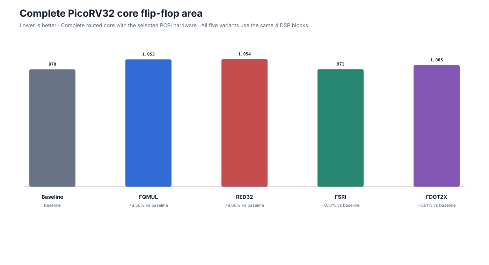

# ML-KEM custom instructions on PicoRV32

This project measures whether four small custom RISC-V instructions can accelerate complete ML-KEM on PicoRV32, and compares the cycle savings against the resulting FPGA area and timing cost.

The experiment has five builds

| Build | Only intended change from baseline |
| --- | --- |
| Baseline | no custom cryptographic instruction |
| FQMUL | replace coefficient multiply followed by Montgomery reduction with FQMUL |
| RED32 | keep ordinary RV32M multiplication and replace its software Montgomery reduction with RED32 |
| FSRI | replace the software expansion of each Keccak rotate with direct funnel shifts |
| DOT2X | replace each pair of products in cached base multiplication with DOT2X |

All five builds use [mlkem-native](https://github.com/pq-code-package/mlkem-native) at commit `69d24e37b8a04c6050ec55bc84a4228d7051bb4b` and [PicoRV32](https://github.com/YosysHQ/picorv32) at commit `a473fc8fca393771d83b0ffcf0b14db3393339d8`.

## Fair comparison

The pinned ML-KEM source does not expose a primitive hook at exactly the required boundary. [`fixed_backend.c`](targets/picorv32/mlkem/fixed_backend.c) therefore reproduces its fixed polynomial schedule. Baseline FQMUL RED32 and DOT2X all compile that same file. The loops transform order reduction points constants and compiler flags are unchanged between them.

The primitive selected at compile time is the only arithmetic difference

```text
baseline   product = a * b       result = software Montgomery reduction
FQMUL                               result = FQMUL a b
RED32      product = RV32M MUL   result = RED32 product
DOT2X      product = DOT2X on two packed coefficient pairs
```

FSRI leaves the same arithmetic backend in place. Its build uses the pinned Keccak source with only the rotate macro replaced. One 64 bit rotate becomes two direct FSRI instructions on RV32.

Every processor uses the same PicoRV32 parameters and the same multiplier in [`pqc_pcpi_mlkem.sv`](targets/picorv32/rtl/pqc_pcpi_mlkem.sv) for ordinary RV32M multiplication. DOT2X uses that multiplier for both products over two cycles. Each custom build enables one additional decoder and data path. This avoids changing the normal multiplication architecture between the baseline and instruction builds.

## Instructions

FQMUL multiplies the signed low halves of its two source registers and Montgomery reduces the product modulo 3329. It responds after four PCPI cycles.

```text
product = signed16(rs1) * signed16(rs2)
inverse = signed16(low16(product * 62209))
rd      = (product - inverse * 3329) / 65536
```

RED32 receives a signed product in its first source register and performs only the same Montgomery reduction. The normal RISC-V `MUL` remains a separate instruction. RED32 responds after three PCPI cycles.

FSRI directly returns the low word of two joined registers shifted by its immediate. It has a combinational response path.

```text
rd = low32(({rs2, rs1} >> shamt)
```

DOT2X treats each source register as two signed 16 bit coefficients and computes
`a0 * b1 + a1 * b0`. It targets the two product expressions in cached ML-KEM
base multiplication while preserving accumulation before Montgomery reduction.
It responds after three PCPI cycles and uses opcode `0x0b` with `funct3 = 3`
and `funct7 = 0`.

DOT2X tests whether packed two product arithmetic provides a better complete
system area versus cycle tradeoff than the existing smaller primitives. The
operation itself is not presented as novel. The contribution is its mapping to
this ML-KEM backend through PicoRV32 PCPI with multiplier reuse simulation
checks formal checking complete ML-KEM benchmarking and area and timing
evaluation.

The instruction wrappers and software references are in [`targets/picorv32/mlkem`](targets/picorv32/mlkem). The complete PCPI implementation is in [`pqc_pcpi_mlkem.sv`](targets/picorv32/rtl/pqc_pcpi_mlkem.sv). Historical sliced and multiplier reuse FSRI implementations are not part of this experiment.

## Results

[`mlkem_bench.c`](targets/picorv32/firmware/mlkem_bench.c) measures key generation encapsulation and decapsulation for all three ML-KEM parameter sets. Every operation uses 30 deterministic inputs and three repeats. The medians below come from PicoRV32 RTL simulation after subtracting measured marker overhead. All five variants produced matching output checksums at each parameter set and every disassembly contained only its intended custom encoding.

### Cycle counts


Each parenthesized value is the change from the matching baseline. Lower is better.

| Parameter set | Baseline | FQMUL | RED32 | FSRI | DOT2X |
| --- | ---: | ---: | ---: | ---: | ---: |
| ML-KEM-512 | 12,928,200 | 12,104,193 (-6.37%) | 12,170,769 (-5.86%) | 8,938,374 (-30.86%) | 12,946,098 (+0.14%) |
| ML-KEM-768 | 20,526,389 | 19,505,483 (-4.97%) | 19,551,307 (-4.75%) | 14,011,166 (-31.74%) | 20,578,559 (+0.25%) |
| ML-KEM-1024 | 31,435,662 | 29,967,799 (-4.67%) | 29,996,508 (-4.58%) | 21,081,744 (-32.94%) | 31,471,662 (+0.11%) |

FSRI has the lowest cycle count at every parameter set. FQMUL is consistently a little faster than RED32. DOT2X adds cycles at every parameter set.

### Where the cycles change


The operation figure shows ML-KEM-512 because it gives the clearest compact comparison. FQMUL reduces key generation by 5.01%, encapsulation by 6.20%, and decapsulation by 7.50%. RED32 follows the same pattern at 4.82%, 5.55%, and 6.86%. FSRI reduces all three operations, with the largest relative change in key generation at 33.79%. DOT2X increases each operation by 0.11% to 0.16%.

The same pattern holds for ML-KEM-768 and ML-KEM-1024 in the canonical raw results.

### Hardware cost




These are complete routed PicoRV32 cores, not isolated instruction blocks. All five variants use 4 DSP blocks and no BRAM.

| Variant | LUT4 | LUT4 change | Flip-flops | DSP | BRAM |
| --- | ---: | ---: | ---: | ---: | ---: |
| Baseline | 3,788 | baseline | 970 | 4 | 0 |
| FQMUL | 3,791 | +3 (+0.08%) | 1,053 (+83) | 4 | 0 |
| RED32 | 3,879 | +91 (+2.40%) | 1,054 (+84) | 4 | 0 |
| FSRI | 4,019 | +231 (+6.10%) | 971 (+1) | 4 | 0 |
| DOT2X | 3,855 | +67 (+1.77%) | 1,005 (+35) | 4 | 0 |

### Timing


Yosys lowers each complete core to ECP5 cells. nextpnr places and routes seeds 1 through 5 for the LFE5U-45F-6BG381C, and ecppack confirms each result can be packed. The route requests 50 MHz. Every seed met that target.

| Variant | Seed Fmax range | Median Fmax | Change from baseline |
| --- | ---: | ---: | ---: |
| Baseline | 57.43 to 68.20 MHz | 64.70 MHz | baseline |
| FQMUL | 54.68 to 61.39 MHz | 59.01 MHz | -8.79% |
| RED32 | 53.18 to 61.43 MHz | 58.36 MHz | -9.80% |
| FSRI | 60.75 to 68.88 MHz | 66.35 MHz | +2.55% |
| DOT2X | 51.54 to 59.97 MHz | 54.95 MHz | -15.07% |

Source hashes, tool versions, commands, and all five seed measurements are recorded in [`results/raw`](results/raw).

### End-to-end tradeoff

Cycle count alone does not show whether a complete processor is faster when the variants route at different frequencies. The following estimate divides each RTL-measured total cycle count by that variant's median routed Fmax. It is not a physical board wall-clock measurement.

| Parameter set | Baseline | FQMUL | RED32 | FSRI | DOT2X |
| --- | ---: | ---: | ---: | ---: | ---: |
| ML-KEM-512 | 199.82 ms | 205.12 ms (+2.65%) | 208.55 ms (+4.37%) | 134.72 ms (-32.58%) | 235.60 ms (+17.91%) |
| ML-KEM-768 | 317.25 ms | 330.55 ms (+4.19%) | 335.01 ms (+5.60%) | 211.17 ms (-33.44%) | 374.50 ms (+18.04%) |
| ML-KEM-1024 | 485.87 ms | 507.84 ms (+4.52%) | 513.99 ms (+5.79%) | 317.74 ms (-34.60%) | 572.73 ms (+17.88%) |

### What worked and what did not

FQMUL saves 824,007 to 1,467,863 cycles by combining multiplication with Montgomery reduction. It adds only 3 LUT4s but adds 83 flip-flops, and its median Fmax falls by 8.79%. The cycle saving does not overcome that timing loss when each design runs at its own median routed Fmax, leaving estimated runtime 2.65% to 4.52% slower than baseline.

RED32 saves 757,431 to 1,439,154 cycles by accelerating only Montgomery reduction after the ordinary RV32M multiply. It adds 91 LUT4s and 84 flip-flops, and median Fmax falls by 9.80%. Its estimated runtime is 4.37% to 5.79% slower than baseline. FQMUL therefore gives a slightly better cycle result with less LUT4 cost and a smaller timing loss than RED32.

FSRI saves 3,989,826 to 10,353,918 cycles by replacing the software expansion of Keccak rotates. Key generation has the largest relative operation saving. FSRI adds 231 LUT4s but only one flip-flop, and its median Fmax is 2.55% higher than baseline. It is the only custom design that improves both cycle count and estimated runtime, reducing the latter by 32.58% to 34.60%.

DOT2X is a useful negative result. It adds 17,898, 52,170, and 36,000 cycles for ML-KEM-512, ML-KEM-768, and ML-KEM-1024 respectively. It also adds 67 LUT4s and 35 flip-flops while reducing median Fmax by 15.07%. Estimated runtime is about 18% slower. The packed arithmetic reduces the number of scalar products, but the packing and instruction execution overhead erase that advantage while the additional hardware also hurts routed timing.

The bounded local formal jobs use the same final RTL and property files.

| Instruction | Formal status |
| --- | --- |
| FQMUL | pending due to solver timeout |
| RED32 | PASS |
| FSRI | PASS |
| DOT2X | pending due to solver timeout |

The measured answer is clear. Small custom instructions can make complete ML-KEM faster on PicoRV32, but the instruction must target enough work without damaging routed timing. FSRI wins cycle count, median Fmax, and estimated runtime. FQMUL has the smallest LUT4 increase and FSRI has the smallest flip-flop increase. FQMUL and RED32 save cycles but are not faster at their own median routed Fmax. DOT2X is not worthwhile in this mapping.

The canonical [`results/summary.json`](results/summary.json) is generated from the 15 benchmark and 5 synthesis JSON files in [`results/raw`](results/raw).

## Build and reproduce

Run every command below from the repository root.

The responsibilities are deliberately split along the normal build-versus-run
boundary. CMake compiles host tests, Verilator models, and RISC-V firmware while
[`run_experiment.py`](scripts/run_experiment.py) runs the benchmark matrix,
formal checks, synthesis, and result aggregation.

### Software build and tests

The host tests need CMake, C and C++ compilers, and Python. The second build runs
the same tests with address and undefined behavior sanitizers.

```sh
cmake -S . -B build/release -DCMAKE_BUILD_TYPE=Release
cmake --build build/release --parallel 4
ctest --test-dir build/release --output-on-failure

cmake -S . -B build/sanitize -DCMAKE_BUILD_TYPE=Debug -DPQC_POLY_SANITIZE=ON
cmake --build build/sanitize --parallel 4
ctest --test-dir build/sanitize --output-on-failure
```

### PicoRV32 build products

PicoRV32 build products use RISC-V GNU toolchain release `2026.07.15` and OSS
CAD Suite release `2026-07-29`. Put `verilator`,
`riscv32-unknown-elf-gcc`, `riscv32-unknown-elf-objcopy`, and
`riscv32-unknown-elf-objdump` on `PATH`. CMake does not require the formal or
synthesis tools.

```sh
cmake -S . -B build/picorv32 -DCMAKE_BUILD_TYPE=Release -DPQC_POLY_PICORV32=ON
cmake --build build/picorv32 --target pqc-picorv32-cpu-models pqc-picorv32-firmware --parallel 4
```

The firmware target creates ELF, HEX, and disassembly files for all 15
variant/parameter-set combinations. Individual targets follow the form
`pqc-picorv32-firmware-fqmul-768`. `pqc-picorv32-sim` remains a small direct RTL
correctness target that builds and runs the five PCPI reference tests.

### Complete experiment

The Python runner configures CMake when build products are needed. Run the direct PCPI tests, complete benchmark matrix, and five synthesis variants as separate stages:

```sh
python3 scripts/run_experiment.py --pcpi
python3 scripts/run_experiment.py --bench
python3 scripts/run_experiment.py --synthesis
```

Formal verification is independent of measurement publication. A solver timeout leaves that instruction pending and does not invalidate benchmark or synthesis results.

```sh
python3 scripts/run_experiment.py --formal
```

The default build directory is `build/picorv32`. Use `--build-dir` to change it.
Runtime tool paths can be selected with `--sby`, `--yosys`, `--nextpnr`, and
`--ecppack`. Extra CMake cache settings can be passed with repeated
`--cmake-arg` options.

The runner keeps the same 30 deterministic inputs, simulator arguments,
disassembly validation, formal jobs, synthesis seeds, and JSON filenames. Its summary stage combines every valid result currently available and reports a partial summary when the matrix is incomplete.

```sh
python3 scripts/run_experiment.py --summary
```

Publish only the compact machine-generated benchmark and synthesis JSON files, then generate the canonical summary and figures:

```sh
mkdir -p results/raw
cp build/picorv32/targets/picorv32/results/{baseline,fqmul,red32,fsri,dot2x}-{512,768,1024}.json results/raw/
cp build/picorv32/targets/picorv32/results/{baseline,fqmul,red32,fsri,dot2x}-synthesis.json results/raw/
python3 scripts/results.py --input results/raw --output results/summary.json --allow-missing
python3 scripts/results.py --input results/raw --output results/summary.json --allow-missing --check
python3 scripts/readme_figures.py
```

[`results/raw`](results/raw) contains the canonical machine measurements. [`results/summary.json`](results/summary.json) is generated from those files, and [`docs/figures`](docs/figures) is generated only from the summary.

The main CMake targets are build products rather than experiment stages:

| CMake target | Product |
| --- | --- |
| `pqc-picorv32-sim` | direct PCPI reference tests for all instruction settings |
| `pqc-picorv32-pcpi-models` | five direct PCPI Verilator executables |
| `pqc-picorv32-cpu-models` | five complete PicoRV32 Verilator executables |
| `pqc-picorv32-firmware` | all 15 RISC-V firmware ELF, HEX, and disassembly sets |
| `pqc-picorv32-firmware-<variant>-<level>` | one firmware artifact set |

## Checks kept in scope

- C and C++ reference tests cover FQMUL RED32 FSRI DOT2X and the fixed backend for all three vector widths
- Verilator compares each instruction RTL against its reference including boundaries random operands reset latency decoding and consecutive requests
- whole processor simulation boots bare metal firmware and runs complete ML-KEM
- each ML-KEM build checks complete cryptographic operation results deterministic repeats and intended instruction use
- short bounded SymbiYosys jobs compare each PCPI response with its arithmetic reference for arbitrary operands in the explored trace
- Yosys nextpnr and ecppack measure the complete core rather than the isolated instruction block

The formal checks are in [`targets/picorv32/formal`](targets/picorv32/formal). They are deliberately local and bounded. They do not prove ML-KEM or PicoRV32 as a whole.

## Limitations

- cycle counts come from PicoRV32 RTL simulation under Verilator and are not wall clock measurements
- hardware values come from ECP5 synthesis placement and routing rather than a physical board measurement
- estimated runtime combines RTL cycle counts with routed median Fmax and is not a physical board wall-clock measurement
- the project makes no claim of physical side channel resistance
- formal checking covers local custom instruction properties within bounded traces not complete ML-KEM or the whole processor
- FQMUL and DOT2X formal jobs remain pending because their solver runs timed out

## Repository map

| Path | Contents |
| --- | --- |
| [`targets/picorv32/mlkem`](targets/picorv32/mlkem) | fixed arithmetic backend and instruction wrappers |
| [`targets/picorv32/rtl`](targets/picorv32/rtl) | PCPI instruction block and complete core wrappers |
| [`targets/picorv32/firmware`](targets/picorv32/firmware) | bare metal startup runtime and complete benchmark |
| [`targets/picorv32/sim`](targets/picorv32/sim) | direct instruction and complete processor Verilator drivers |
| [`targets/picorv32/formal`](targets/picorv32/formal) | direct bounded PCPI properties |
| [`targets/picorv32/synth`](targets/picorv32/synth) | complete core Yosys script |
| [`scripts`](scripts) | experiment orchestration, ECP5 routing, result validation, and README figures |

## Standards and tools

ML-KEM is specified in [FIPS 203](https://csrc.nist.gov/pubs/fips/203/final). SHA3 and SHAKE are specified in [FIPS 202](https://csrc.nist.gov/pubs/fips/202/final). The implementation flow uses Verilator for RTL simulation Yosys for synthesis and nextpnr for ECP5 placement and routing.
