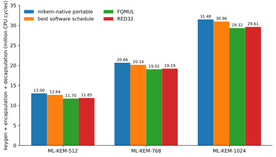

# ML-KEM software and custom RISC-V instructions on PicoRV32

This repository evaluates ML-KEM software schedules and two custom RISC-V instructions on PicoRV32. The ML-KEM code comes from a pinned `mlkem-native` revision. Every variant is compiled as bare-metal RV32IMC firmware and run on PicoRV32 RTL with Verilator. The same RTL is also synthesized and routed for an ECP5 FPGA.

The reference point for performance is the portable arithmetic path from the pinned `mlkem-native` source. The repository then compares that baseline with a tuned software schedule, FQMUL, and RED32.

## Results

A CPU cycle is one processor clock tick. At the 50 MHz test clock used here, one cycle is 20 ns. Fewer cycles means less execution time when the designs use the same clock frequency.

The **portable baseline** is the pinned `mlkem-native` portable arithmetic path. The **best software schedule** is the fastest of 24 generated schedules that use only standard RISC-V instructions. FQMUL and RED32 each search the same 24 schedule choices again with the custom instruction enabled.

The table reports key generation + encapsulation + decapsulation. Percentages are relative to the portable baseline.

| parameter set | portable baseline | best software schedule | FQMUL | RED32 |
|---|---:|---:|---:|---:|
| ML-KEM-512 | 13,004,560 | 12,636,735 (-2.83%) | **11,703,506 (-10.00%)** | 11,847,177 (-8.90%) |
| ML-KEM-768 | 20,658,560 | 20,143,356 (-2.49%) | **19,023,552 (-7.91%)** | 19,187,466 (-7.12%) |
| ML-KEM-1024 | 31,479,592 | 30,964,081 (-1.64%) | **29,318,051 (-6.87%)** | 29,614,042 (-5.93%) |



Lower bars are faster at the fixed 50 MHz clock. The best software schedule improves on the portable baseline before any custom instruction is added. FQMUL is the fastest current implementation for all three parameter sets.

### FPGA cost

The hardware table uses four FPGA terms:

`LUT4` is a 4-input lookup table used to implement logic. More LUT4s means more FPGA logic area. A flip-flop stores one bit of state. A DSP block is a dedicated arithmetic block, usually used for multiplication. `Fmax` is the highest clock frequency that the routed design is estimated to meet. Higher Fmax is better.

The experiments target 50 MHz. All five routing seeds for all three designs meet 50 MHz. Fmax is still useful because it shows how much timing margin the custom logic removes.

| design | LUT4 | flip-flops | DSP | BRAM | median Fmax |
|---|---:|---:|---:|---:|---:|
| baseline PicoRV32 | 3,583 | 970 | 4 | 0 | 68.70 MHz |
| FQMUL | 3,788 (+5.72%) | 1,053 (+8.56%) | 4 | 0 | 60.51 MHz (-11.92%) |
| RED32 | 3,816 (+6.50%) | 1,053 (+8.56%) | 4 | 0 | 60.20 MHz (-12.37%) |

FQMUL and RED32 both reduce ML-KEM cycle counts at 50 MHz. They also increase logic area and lower Fmax. The current FQMUL implementation is better than RED32 on both cycle count and LUT use. These are first hardware implementations, so the repository does not treat either result as an optimized microarchitecture.

The machine-readable numbers are in [`results/current-comparison.json`](results/current-comparison.json). [`scripts/plot_results.py`](scripts/plot_results.py) regenerates the figure from that file.

## Software schedule search

ML-KEM uses number theoretic transforms and base multiplication for polynomial arithmetic. The arithmetic result is fixed, but the order of operations and reduction points can change.

Each parameter set tests these choices:

| part | choices |
|---|---|
| forward NTT | one layer at a time, fuse two layers |
| inverse NTT | one layer at a time, fuse two layers |
| inverse reduction | reduce every layer, reduce after each layer pair |
| base multiplication | cached late, cached eager, direct eager |

This gives 24 software schedules per parameter set. The best no-extension schedule is `ffuse2_ifuse2_rpair_bcachelate` for ML-KEM-512, ML-KEM-768, and ML-KEM-1024.

The tuned software result is kept separate from the portable baseline for one reason: it shows how much improvement comes from software scheduling alone. The custom-instruction comparison can then be read both against upstream portable code and against the best software schedule found by the same search.

Schedule generation and checking live in [`src/`](src/). Generated code is compiled with `-O3` for RV32IMC and linked into the bare-metal benchmark firmware in [`targets/picorv32/firmware/`](targets/picorv32/firmware/).

## Custom instructions

Both instructions use the RISC-V `custom-0` opcode space. PicoRV32 sends unsupported non-branching instructions through its Pico Co-Processor Interface, or PCPI. The custom arithmetic unit in this repository is connected through PCPI.

ML-KEM uses modulus `q = 3329` and Montgomery radix `R = 2^16`. Both instructions use the same Montgomery reduction.

### FQMUL

FQMUL takes the signed low 16 bits of two source registers. It multiplies them and performs the ML-KEM Montgomery reduction in one custom instruction.

```text
a = sign16(rs1)
b = sign16(rs2)
t = a * b
u = sign16((low16(t) * 62209) mod 2^16)
rd = (t - u * 3329) / 2^16
```

The current RTL responds after four arithmetic cycles. The encoding is `custom-0`, `funct3 = 0`, `funct7 = 0`.

The C model and inline instruction are in [`targets/picorv32/mlkem/fqmul.h`](targets/picorv32/mlkem/fqmul.h). The RTL is in [`targets/picorv32/rtl/pqc_pcpi_mlkem.sv`](targets/picorv32/rtl/pqc_pcpi_mlkem.sv). The completed formal and CBMC record is in [`fqmul-formal.json`](results/raw/picorv32-step3-fd803594-69d24e37/fqmul-formal.json).

The reduction follows the Montgomery form used by Kyber. Related RISC-V work appears in E. Alkim, H. Evkan, N. Lahr, R. Niederhagen, and R. Petri, [ISA Extensions for Finite Field Arithmetic: Accelerating Kyber and NewHope on RISC-V](https://doi.org/10.13154/TCHES.V2020.I3.219-242), TCHES 2020(3).

### RED32

RED32 takes an already-computed signed 32-bit value in `rs1` and performs only the Montgomery reduction.

```text
t = sign32(rs1)
u = sign16((low16(t) * 62209) mod 2^16)
rd = (t - u * 3329) / 2^16
```

The current RTL responds after three arithmetic cycles. The encoding is `custom-0`, `funct3 = 1`, `funct7 = 0`. `rs2` is encoded as `x0`.

An ML-KEM multiplication using RED32 executes a normal RISC-V `MUL` first and RED32 second. This separates multiplication from reduction so its hardware cost can be compared with the fused FQMUL design.

The C model and inline instruction are in [`targets/picorv32/mlkem/red32.h`](targets/picorv32/mlkem/red32.h). The RTL is in [`targets/picorv32/rtl/pqc_pcpi_mlkem.sv`](targets/picorv32/rtl/pqc_pcpi_mlkem.sv). The direct RTL test is [`targets/picorv32/sim/red32_pcpi.cpp`](targets/picorv32/sim/red32_pcpi.cpp).

The arithmetic is the same Montgomery reduction used by ML-KEM and Kyber. The Kyber reference implementation is available in [`ref/reduce.c`](https://github.com/pq-crystals/kyber/blob/main/ref/reduce.c).

## Testing

Verilator compiles the SystemVerilog RTL into an executable model. The benchmark harness drives that model one clock cycle at a time. The cycle counts above therefore come from the processor RTL, not from host wall-clock timing.

The project checks the software and hardware at several levels:

| test | what it checks | result |
|---|---|---|
| host unit tests | schedule enumeration, legality checks, generated C, result parsing | pass |
| ASan and UBSan | memory errors and undefined behavior in host tests and generated host code | pass |
| FQMUL formal + CBMC | instruction arithmetic, PCPI handshake, standard multiply behavior, bounded retirement, C models | pass |
| RED32 direct RTL test | arithmetic, exact 3-cycle response, reset, back-to-back requests, decode isolation | pass |
| full RED32 ML-KEM run | all 72 RED32 schedule variants execute correctly on PicoRV32 RTL | pass |
| ECP5 synthesis | LUT4, flip-flops, DSP, BRAM, and routed Fmax over five seeds | complete |
| RED32 PCPI formal | instruction arithmetic and handshake properties | pass |
| RED32 RVFI bounded check | architectural retirement over a 24-cycle bound | pass |
| RED32 RVFI cover | confirms the custom instruction can reach retirement in the formal model | pass |
| RED32 noninterference PDR | unbounded comparison of the core with RED32 enabled and disabled for non-RED32 instructions | not completed |

The direct RED32 RTL test uses 13 boundary values, every possible low 16-bit value, and 100,000 deterministic random 32-bit inputs. It also checks ordinary `MUL`, reset cancellation, back-to-back RED32 operations, and decode separation from FQMUL.

The full RED32 run tests 24 schedules for each of the three ML-KEM parameter sets. Each schedule records 510 measurements. Five arithmetic kernels use 16 inputs with three repeats. Key generation, encapsulation, and decapsulation use 30 inputs with three repeats. This produces 12,240 records per parameter set. Repeats must agree. Decapsulation also checks that both shared secrets match.

The RED32 noninterference PDR task did not return PASS or FAIL in practical time and was stopped. The repository records that state as incomplete in [`results/red32-verification.json`](results/red32-verification.json).

The current tests do not prove physical side-channel resistance. The project also does not yet contain a physical FPGA board measurement.

## Reproduce the results

A normal host build needs CMake and a C++20 compiler.

```bash
cmake --preset release
cmake --build --preset release --parallel
ctest --preset release
```

Run the sanitizer build separately:

```bash
cmake --preset sanitize
cmake --build --preset sanitize --parallel
ASAN_OPTIONS=detect_leaks=0 ctest --preset sanitize
```

The completed target experiments used these releases:

| tool | release |
|---|---|
| RISC-V GNU toolchain | 2026.07.15 |
| OSS CAD Suite | 2026-07-29 |
| CBMC | 6.10.0, verification only |

Put the RISC-V toolchain and OSS CAD Suite executables on `PATH`. The target build fetches the pinned PicoRV32 and `mlkem-native` sources.

Configure the target build:

```bash
cmake -S . -B build/picorv32-study -G Ninja \
  -DCMAKE_BUILD_TYPE=Release \
  -DPQC_POLY_LTO=OFF \
  -DPQC_POLY_PICORV32_MLKEM=ON \
  -DPQC_POLY_PICORV32_SYNTHESIS=ON
```

Run the portable baseline and all 24 no-extension software schedules:

```bash
cmake --build build/picorv32-study \
  --target pqc-picorv32-mlkem \
  --parallel 8
```

Run FQMUL:

```bash
cmake --build build/picorv32-study \
  --target pqc-picorv32-fqmul \
  --parallel 8
```

Run the direct RED32 RTL test, then the full RED32 sweep:

```bash
cmake --build build/picorv32-study \
  --target pqc-picorv32-red32-pcpi \
  --parallel 8

cmake --build build/picorv32-study \
  --target pqc-picorv32-red32 \
  --parallel 8
```

Run the baseline/FQMUL and baseline/RED32 FPGA synthesis comparisons:

```bash
cmake --build build/picorv32-study \
  --target pqc-picorv32-fqmul-synthesis \
  --parallel 8

cmake --build build/picorv32-study \
  --target pqc-picorv32-red32-synthesis \
  --parallel 8
```

Rebuild the compact comparison file and graph from the generated measurements:

```bash
python3 scripts/report_results.py build/picorv32-study \
  --output results/current-comparison.json
python3 scripts/plot_results.py
```

Formal verification is separate from the performance and synthesis runs. Enable it with `-DPQC_POLY_PICORV32_FQMUL_VERIFY=ON`. The aggregate RED32 verification target also includes the unfinished noninterference PDR task, so it can run for a long time.

### Output locations

| output | path |
|---|---|
| portable, software, and FQMUL measurements | `build/picorv32-study/targets/picorv32/mlkem-results/` |
| RED32 measurements | `build/picorv32-study/targets/picorv32/red32-results/` |
| synthesis JSON | `build/picorv32-study/targets/picorv32/results/` |
| committed Step 3 records | `results/raw/picorv32-step3-fd803594-69d24e37/` |
| compact current comparison | `results/current-comparison.json` |

## References

ML-KEM is specified in [NIST FIPS 203](https://doi.org/10.6028/NIST.FIPS.203). The implementation under test is the pinned [`mlkem-native`](https://github.com/pq-code-package/mlkem-native) codebase.

PicoRV32 and PCPI are documented in the [PicoRV32 repository](https://github.com/YosysHQ/picorv32). The RISC-V opcode map documents the [`custom-0` through `custom-3` opcode spaces](https://docs.riscv.org/reference/isa/v20260120/unpriv/rv-32-64g.html).
